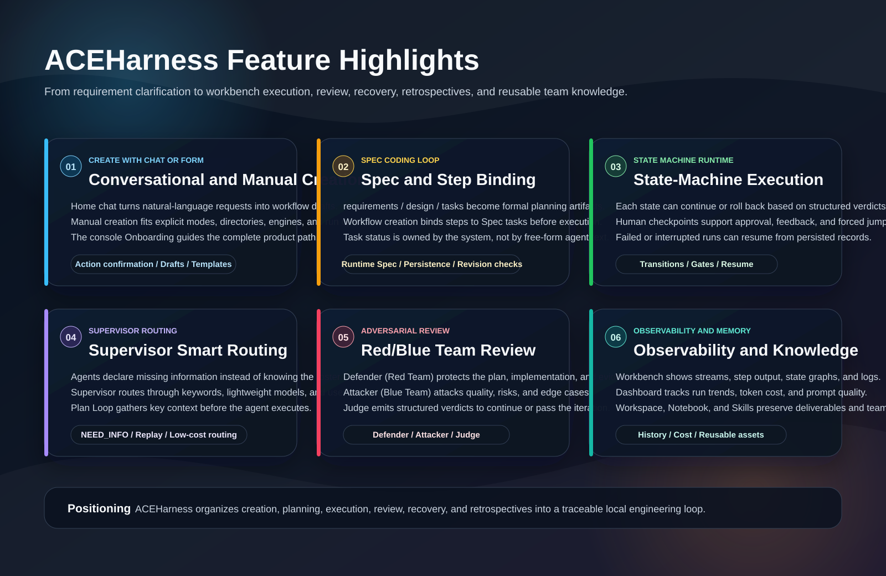
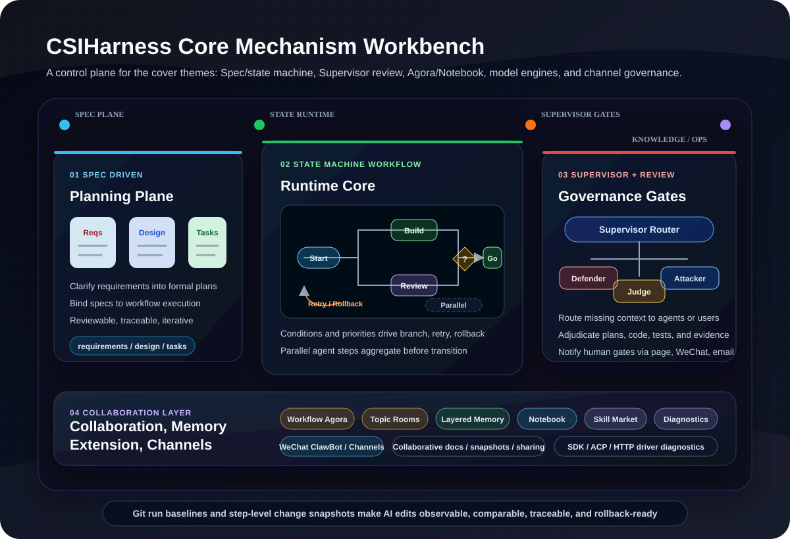
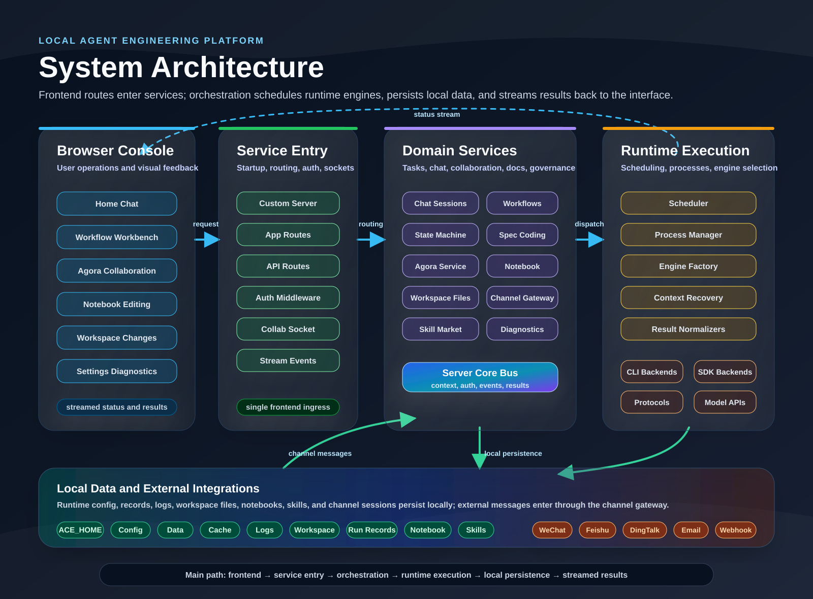
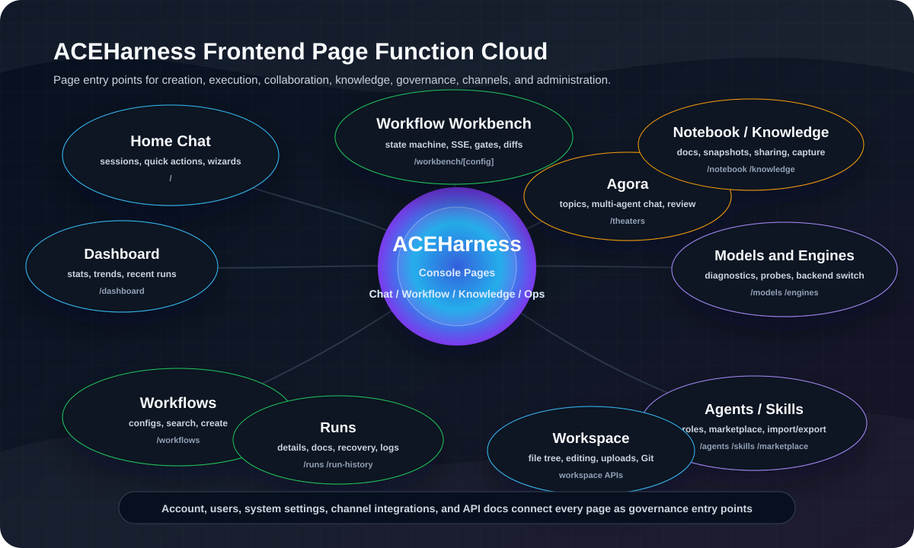
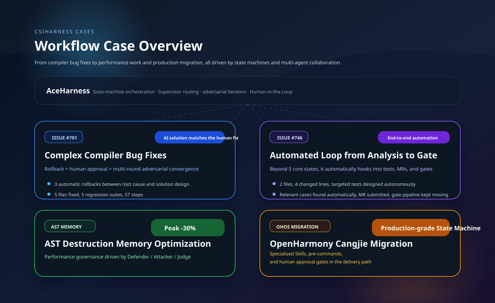

<div align="center">

<p>
  
</p>

# CSIHarness Power By ACE/AET

<p>
  <strong>Your team of AI</strong><br>
  Powered By Cangjie Team
</p>

English | [中文](./README.md)

<p>
  <strong>Enterprise-grade AI multi-agent collaboration system</strong><br>
  Spec Driven Development / state-machine workflows / Supervisor routing / adversarial iteration / multi-agent Agora / long-term memory
</p>


CSIHarness is a local AI Multi-Agent workbench for engineering tasks. It combines Spec Driven Development, state-machine workflows, Supervisor routing, adversarial iteration, multi-agent Agora rooms, Git-backed change checkpoints, layered long-term memory, Notebook knowledge capture, Skill-based extension, and model/engine diagnostics so complex development work can be planned, executed, collaborated on, reviewed, rolled back, resumed, and replayed.

<p>
  
</p>

</div>

---

## Table of Contents

- [Product Overview](#product-overview)
- [Quick Start](#quick-start)
- [Core Mechanisms](#core-mechanisms)
- [Architecture](#architecture)
- [Functional Modules](#functional-modules)
- [Workflow Cases](#workflow-cases)
- [Configuration and Engines](#configuration-and-engines)
- [Channel Integrations](#channel-integrations)
- [Documentation](#documentation)
- [Developer Reference](#developer-reference)
- [Contributing](#contributing)
- [License](#license)

---

## Product Overview

CSIHarness organizes engineering tasks around planning, execution, collaboration, knowledge, extension, and external channels. The capability map below expands the main entry points for daily work.

<picture>
    <source media="(prefers-color-scheme: dark)" srcset="public/images/features-overview.en.svg">
    
</picture>

---

## Quick Start

### Requirements

- Node.js `>= 20` / npm `>= 9`
- One AI execution engine: `claude-code`, `kiro-cli`, `opencode`, `nga`, `codegenie`, `cursor`, `codex`, `trae-cli`, or `magic-cli`

### Install and Run

Get started quickly:

```bash
npm install -g csiharness

csiharness --help
csiharness
# ✔ Please select a language › English
# [CSI] Welcome. First launch will initialize local runtime settings.
# ...
# [CSI] Starting server: http://127.0.0.1:3001
# [CSIHarness] Server ready on http://0.0.0.0:3001
# [CSI] Open http://127.0.0.1:3001 in your browser
```

If you are a developer:

```bash
git clone https://gitcode.com/Cangjie-SIG/ACEHarness.git && cd ACEHarness

# Install dependencies
npm install

# Local development: builds the CLI first, then starts the dev server
CSIHARNESS_HOST=0.0.0.0 CSIHARNESS_PORT=3000 npm run dev

# Windows PowerShell:
# $env:CSIHARNESS_HOST="0.0.0.0"
# $env:CSIHARNESS_PORT="3000"
# npm run dev

# Production mode: build after the first clone or after updates
npm run build
CSIHARNESS_HOST=0.0.0.0 CSIHARNESS_PORT=3000 npm start
```

Open `http://127.0.0.1:3001` after startup. After entering the console, use Onboarding to learn the complete usage path and module guide. In PowerShell production mode, set `$env:CSIHARNESS_HOST` and `$env:CSIHARNESS_PORT` before running `npm start`.

Global CSIHarness Service commands:

```bash
csiharness              # Start CSIHarness Service
csiharness start        # Start CSIHarness Service explicitly
csiharness service      # Inspect and stop managed CSIHarness instances
csiharness update       # Update to the npm latest version
csiharness update beta  # Update to a specific npm tag or version, such as beta / release / 1.0.0-beta.66
```

When `csiharness update` finds managed CSIHarness instances still running, interactive terminals can stop them before updating, continue without stopping them, or cancel the update. Scripts can use `csiharness update --stop-running` to stop running instances first, or `csiharness update --force` to keep installing while they run; those services use the new version after restart.

---

## Core Mechanisms



The workbench diagram above now carries the core mechanism details: Spec planning, state-machine execution, Supervisor routing, adversarial review, Agora collaboration, persistent memory, capability extension, model diagnostics, and external channels form one governed engineering loop.

---

## Architecture



Notes:
- The browser console contains the main pages: Home chat, workflow workbench, Agora, Notebook, Workspace, settings, and diagnostics.
- Service entry centralizes startup, app routes, API routes, authentication, collaboration sockets, and streamed events.
- Domain services cover tasks, chat, state machines, spec coding, Agora, Notebook, Workspace, channels, skills, and model diagnostics.
- Runtime execution connects schedulers, process management, engine factories, context recovery, and result normalization to multiple execution backends.
- The local data root persists config, data, cache, logs, workspaces, run records, notebooks, and skills, while external channel messages enter the same context.

## Functional Modules



The CSIHarness interface is organized around daily engineering work:

- **Home chat**: regular AI conversations, workflow creation, Agora entry points, and WeChat ClawBot session binding.
- **Agora**: topic-based or workflow-bound multi-agent chat for design discussion, disagreement resolution, and retrospectives.
- **Workflow workbench**: state-machine execution, streamed step output, human checkpoints, Preflight results, Git step changes, run recovery, and subworkflow steps that embed another state-machine workflow.
- **Workspace and Changes**: embedded file editing, directory browsing, Git diff, step-level change review, and baseline comparison.
- **Cangjie Notebook**: personal and team spaces for documents, notes, run outputs, and retrospectives with collaborative editing, snapshots, and sharing.
- **Model and engine diagnostics**: standard probes for model and execution-backend evaluation, including SDK, ACP, HTTP drivers, and streaming-event troubleshooting.
- **Governance and access**: account, users, system settings, channel integrations, and API docs connect all pages as governance entry points.

## Workflow Cases



Read the root-cause paths, execution data, and delivery results for all four cases in [Workflow Cases](https://gitcode.com/Cangjie-SIG/ACEHarness/blob/main/docs/workflow-cases.en.md).

## Configuration and Engines

CSIHarness configuration is driven by the startup wizard, the engine management page, and environment variables. This repository currently supports local execution backends including `claude-code`, `kiro-cli`, `opencode`, `nga`, `codegenie`, `cursor`, `codex`, `trae-cli`, and `magic-cli`; the model and engine diagnostics workbench can verify connectivity, streaming events, structured output, coding, math, and reasoning behavior.

### CSIHarness Service

`server.js` loads `.env`, `.env.local`, and the mode-specific `.env.development*` / `.env.production*` files on startup. Values already present in the shell, process manager, or startup script take precedence and are not overwritten by env files.

Core startup and runtime-directory variables:

| Variable | Description | Default / precedence |
|------|-------------|----------------------|
| `CSIHARNESS_HOST` | Server bind address | `127.0.0.1` |
| `CSIHARNESS_PORT` | CSIHarness service port | `3000` |
| `PORT` | Generic service port | Higher priority than `CSIHARNESS_PORT` |
| `BASEURL` / `BASE_URL` | Reverse-proxy subpath or public site prefix used for application routes and static asset URLs | Empty when unset; examples: `/ace` or `https://example.com/ace` |
| `CSIHARNESS_HOME` | CSIHarness runtime root; controls where `config/`, `data/`, `cache/`, `logs/`, and `workspace/` live | Falls back by platform when unset |
| `APPDATA` | Windows fallback root for `CSIHARNESS_HOME` | `<APPDATA>/CSIHarness` |
| `XDG_DATA_HOME` | Linux / macOS fallback root for `CSIHARNESS_HOME` | `<XDG_DATA_HOME>/csiharness` |

When serving CSIHarness under a reverse-proxy subpath, set the same `BASEURL` during build and startup. For example, proxying external `/ace/` to local `http://127.0.0.1:3001/`:

```bash
BASEURL=/ace CSIHARNESS_HOST=127.0.0.1 CSIHARNESS_PORT=3001 npm run build
BASEURL=/ace CSIHARNESS_HOST=127.0.0.1 CSIHARNESS_PORT=3001 npm start
```

Development mode:

```bash
BASEURL=/ace CSIHARNESS_HOST=127.0.0.1 CSIHARNESS_PORT=3001 npm run dev
```

Windows PowerShell:

```powershell
$env:BASEURL="/ace"
$env:CSIHARNESS_HOST="127.0.0.1"
$env:CSIHARNESS_PORT="3000"
npm run dev
```
| `CSIHARNESS_INSTALL_ROOT` | Install root used to locate `configs/`, `dist/`, and other packaged files | Auto-filled to the current install directory when unset |
| `CSIHARNESS_LOCALE` | Default locale for the CSIHarness CLI and service | Higher priority than `LANG` / `LC_ALL` |
| `LANG` | Locale fallback variable | Used when `CSIHARNESS_LOCALE` is unset |
| `LC_ALL` | Locale fallback variable | Used when `CSIHARNESS_LOCALE` and `LANG` are unset |
| `NODE_ENV` | Runtime mode; also affects `.env*` loading and some debug defaults | `production` for managed child services |
| `CSIHARNESS_MAX_OLD_SPACE_MB` | V8 old-space heap limit (MB) for the server process; overrides the auto value | Auto: ~60% of RAM, clamped to `4096`–`8192` |
| `CSIHARNESS_MEM_WATCHDOG` | Memory-watchdog toggle; gracefully restarts before OOM when thresholds are crossed | Enabled by default; set `0` to disable |
| `CSIHARNESS_MEM_SOFT_PCT` | Soft threshold (fraction of heap limit); graceful restart only while idle | `0.80` |
| `CSIHARNESS_MEM_HARD_PCT` | Hard threshold (fraction of heap limit); unconditional forced restart to avoid OOM | `0.92` |
| `CSIHARNESS_MANAGED` | Internal flag marking the server process as daemon-supervised so the watchdog may self-restart | Set automatically by the CLI; not for manual use |

Public-origin and channel-recovery variables:

| Variable | Description | Default / precedence |
|------|-------------|----------------------|
| `CSIHARNESS_PUBLIC_ORIGIN` | Absolute public origin used for webhook URLs, callbacks, and the official WeChat bridge | Highest priority |
| `CSIHARNESS_WECHAT_AUTO_RESTORE` | Auto-restore official WeChat bridges after the service starts | Enabled by default; disable with `0` / `false` |
| `CSIHARNESS_WECHAT_RESTORE_DELAY_MS` | Delay before official WeChat bridge restore (ms) | `3000` |

## Channel Integrations

CSIHarness can bridge workflow runtime conversations, human checkpoints, and multi-agent Agora rooms to external chat platforms. Built-in provider templates include `Feishu`, `DingTalk`, `WeChat Bridge`, and `Generic Webhook`; `POST /api/channels/setup` can generate the webhook and shared secret, and external platforms or bridge services can deliver messages to `/api/channels/inbound/:integrationId`.

See [Channel Integrations](./docs/channel-integrations.md) for details.

---

## Documentation

- [Workflow Cases](https://gitcode.com/Cangjie-SIG/ACEHarness/blob/main/docs/workflow-cases.en.md): full retrospectives for the four workflow cases
- [ACP Code Agent integration checklist](https://gitcode.com/Cangjie-SIG/ACEHarness/blob/main/docs/acp-code-agent-integration-checklist.md): reference checklist for ACP Code Agent integration and validation

---

## Developer Reference

### Project Structure

| Path | Description |
|------|-------------|
| `bin/` | npm CLI entry; the `csiharness` command loads built `dist/cli.js` |
| `server.js` | Custom Next.js launcher for `.env*` loading, HTTP service startup, and Notebook collaboration WebSocket |
| `src/app/` | Next.js App Router pages and API routes |
| `src/components/` | Frontend components for workbench, chat, Notebook, workspace, and related views |
| `src/lib/` | Core workflow engine, Spec Coding, auth, run records, scheduling, models, and workspace logic |
| `configs/` | Workflow configuration and built-in agent/role configuration |
| `skills/` | Skills distributed with the package |
| `messages/` | Chinese and English UI messages |
| `public/` | Images used by the README and frontend |
| `tests/` | Vitest test cases |

### Common Commands

Commands come from `package.json`.

```bash
npm run dev              # Local development, builds the CLI first and starts dev mode
npm run build            # Build the CLI and Next.js app
npm start                # Start the production build
npm test                 # Run Vitest tests
npm run test:components  # Run component tests in jsdom
npm run lint             # Run Next.js lint
npm run check:engines    # Check available local AI execution engines
npm run clean            # Remove dist, .next, and dist-build
npm run publish:beta     # Build and publish the npm package with the beta tag
```

CLI commands come from `src/cli.ts`.

```bash
csiharness                # Start CSIHarness
csiharness start          # Start CSIHarness
csiharness service        # Inspect and stop CSIHarness services
csiharness update         # Update to the npm latest version
csiharness update beta    # Update to a specific npm tag or version
csiharness reset --force  # Reset local CSIHarness configuration
csiharness --help         # Show help
```

### Testing and Quality

The test framework is Vitest. `vitest.config.ts` matches `tests/**/*.test.ts` and `tests/**/*.test.tsx` by default.

```bash
npm test
npm run test:components
npm run lint
```

### Tech Stack

| Category | Technology |
|------|------|
| App framework | Next.js 16.1, React 18.2, TypeScript 5 |
| UI and interaction | Tailwind CSS 3.4, Shadcn/ui, Radix UI, Base UI, Framer Motion, Vaul |
| Editing and collaboration | Tiptap 3, Yjs, y-websocket, Monaco Editor |
| Workflow and configuration | Zod 4, YAML, node-cron, tar-stream, unzipper, yazl |
| Visualization | ReactFlow 11, Recharts 3, Mermaid 11 |
| Forms and drag-and-drop | React Hook Form 7, @dnd-kit |
| Markdown and docs | react-markdown, remark-gfm, rehype-raw, KaTeX |
| AI SDKs and execution backends | Anthropic Claude Agent SDK, OpenAI Codex SDK, `claude-code` / `kiro-cli` / `opencode` / `nga` / `codegenie` / `cursor` / `codex` / `trae-cli` / `magic-cli` |
| Testing | Vitest 4, Testing Library, jsdom |
| Themes | next-themes |

### Documentation Maintenance

Update this README when any of the following changes:

- `package.json` scripts, `bin`, `files`, or publishing flow
- documented environment variable changes
- `src/app/` page entries, API categories, or major user flows
- workflow, Spec Coding, engine, auth, Notebook, or other core mechanisms in `src/lib/`
- built-in agents, configs, or Skills
- release version, license wording, or repository URLs

---

## Contributing

This README keeps a simplified contribution flow. If the repository later adds a dedicated `CONTRIBUTING.md`, this section should link to the formal guide.

```bash
# Fork → create a branch → commit → PR
git checkout -b feature/your-feature
git commit -m "feat: add new feature"
git push origin feature/your-feature
```

Commit messages follow [Conventional Commits](https://www.conventionalcommits.org/): `feat` / `fix` / `docs` / `perf` / `refactor` / `test` / `chore`

---

## License

CSIHarness is licensed under Apache-2.0 with Runtime Library Exception. See [LICENSE](https://gitcode.com/Cangjie-SIG/ACEHarness/blob/main/LICENSE).
