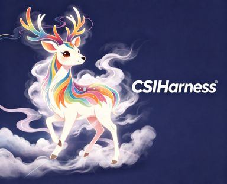
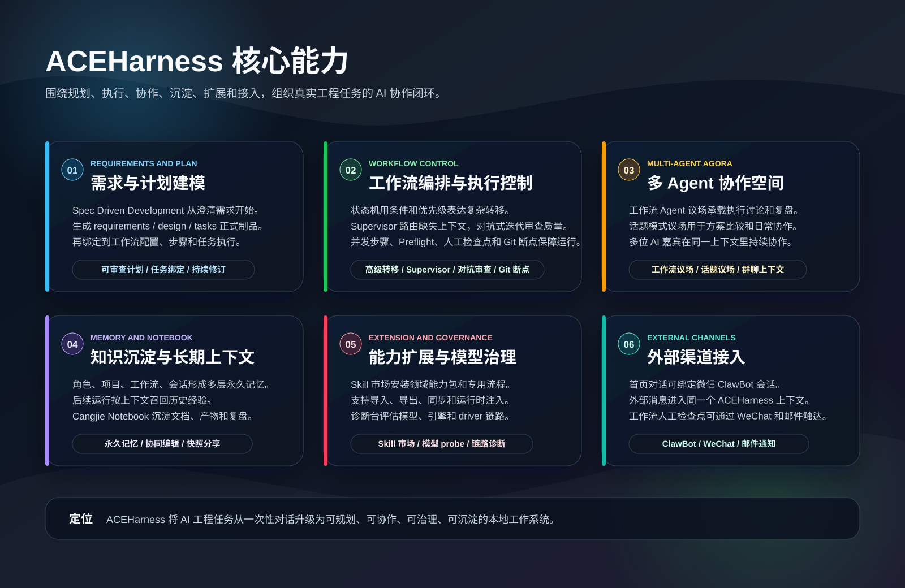
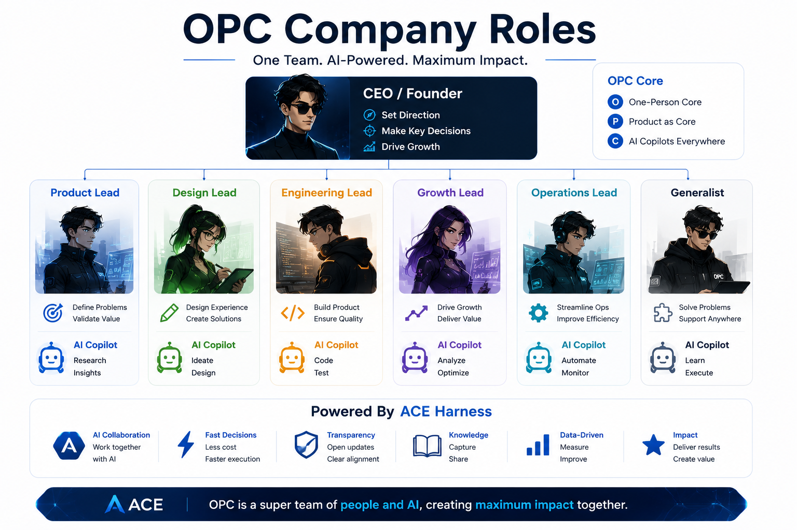
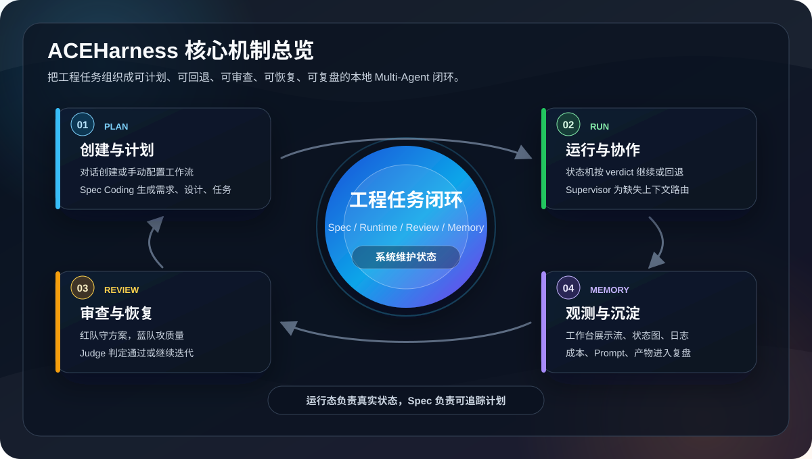
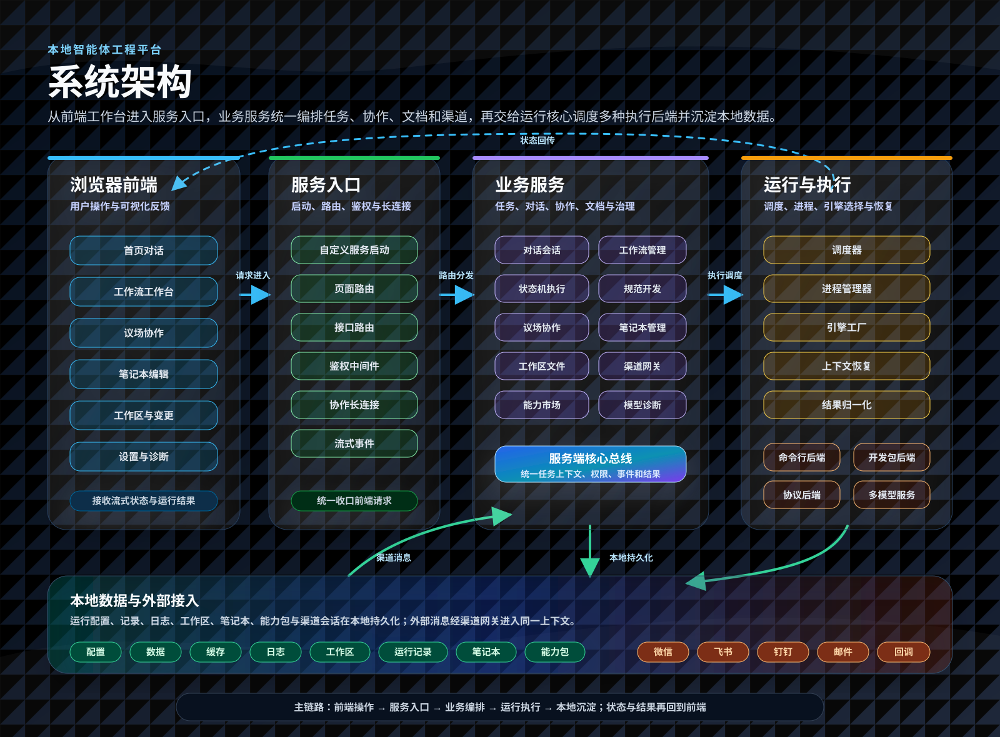
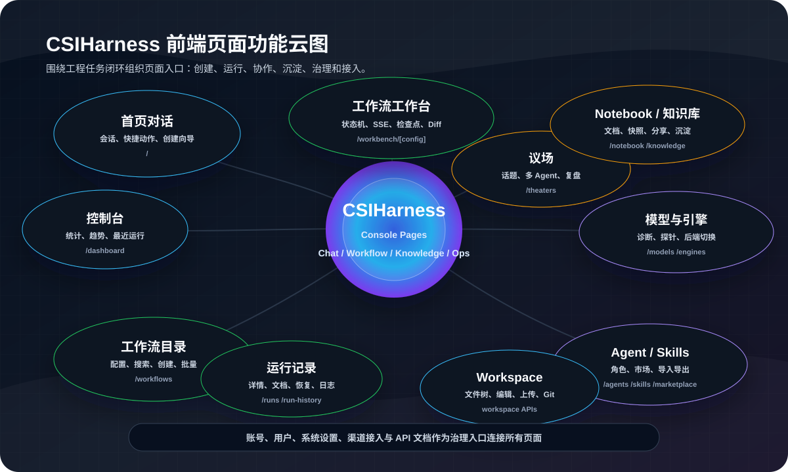
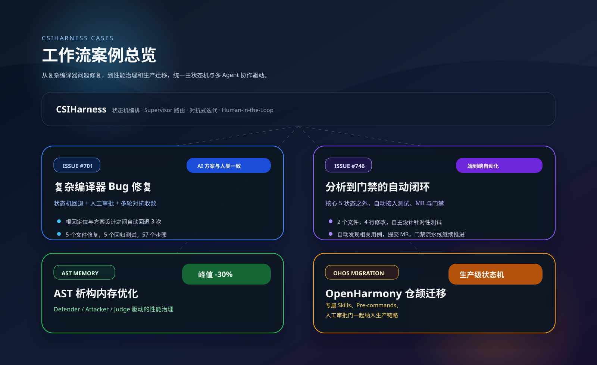

<div align="center">

<p>
  
</p>

# CSIHarness Power By ACE/AET

<p>
  <strong>重构你的 Agent 生产力 | Your team of AI</strong><br>
  仓颉团队出品
</p>

[English](./README.en.md) | 中文

<p>
  <strong>企业级 AI Multi-Agent 智能协作系统</strong><br>
  Spec Driven Development / 状态机工作流 / Supervisor 智能路由 / 对抗式迭代 / 多 Agent 议场 / 长期记忆
</p>


  
CSIHarness 是一个面向工程任务的本地 AI Multi-Agent 协作平台。它把 Spec Driven Development、状态机工作流、Supervisor 智能路由、对抗式迭代、多 Agent 议场、Git 基线断点、多层永久记忆、Notebook 知识沉淀、Skill 能力扩展和模型/引擎诊断组合在一起，让复杂研发任务可以被规划、执行、协作、审查、回退、恢复和复盘。

<p>
  
</p>

</div>

---

## 目录

- [产品全景](#产品全景)
- [一人公司模式](#一人公司模式)
- [快速开始](#快速开始)
- [核心机制](#核心机制)
- [系统架构](#系统架构)
- [产品界面](#产品界面)
- [工作流案例](#工作流案例)
- [配置与引擎](#配置与引擎)
- [渠道接入](#渠道接入)
- [文档](#文档)
- [开发参考](#开发参考)
- [贡献指南](#贡献指南)
- [许可证](#许可证)

---

## 产品全景

CSIHarness 按“规划、执行、协作、沉淀、扩展、接入”组织工程任务闭环；下图展开核心能力入口，便于从产品全景进入日常工作流。

<picture>
    <source media="(prefers-color-scheme: dark)" srcset="public/images/features-overview.svg">
    
</picture>

---

## 一人公司模式

一人公司模式把 `/office` 办公室变成个人 AI 团队桌面，用户用一句话组建或调整产品、设计、工程、增长、运营等 Agent 角色，并通过工位、组织图、私聊/群聊和长期记忆持续协作。



---

## 快速开始

### 前置条件

- Node.js `>= 20` / npm `>= 9`：运行 Next.js 服务与 npm CLI 包
- AI 执行引擎：`claude-code`、`kiro-cli`、`opencode`、`nga`、`codegenie`、`cursor`、`codex`、`trae-cli`、`magic-cli` 等至少一种

### 安装与运行

快速开始：

```bash
npm install -g csiharness

csiharness --help
csiharness
# ✔ 请选择语言 › 中文
# [CSI] 欢迎使用。首次启动将初始化本地运行配置。
# ...
# [CSI] 正在启动服务：http://127.0.0.1:3001
# [CSIHarness] Server ready on http://0.0.0.0:3001
# [CSI] 请在浏览器中打开 http://127.0.0.1:3001
```

首次访问会进入初始化流程：创建管理员、选择语言、配置默认工作目录和可用 AI 引擎。后续团队成员可通过注册页申请账号，由管理员审核后使用。进入控制台后，可通过 Onboarding 查看完整使用路径和模块引导。

如果您是开发者：

```bash
git clone https://gitcode.com/Cangjie-SIG/ACEHarness.git && cd ACEHarness

# 安装依赖
npm install

# 本地调试：npm run dev 会先构建 CLI，再启动开发服务
CSIHARNESS_HOST=0.0.0.0 CSIHARNESS_PORT=3000 npm run dev

# Windows PowerShell:
# $env:CSIHARNESS_HOST="0.0.0.0"
# $env:CSIHARNESS_PORT="3000"
# npm run dev

# 生产模式：首次启动或代码更新后先构建
npm run build
CSIHARNESS_HOST=0.0.0.0 CSIHARNESS_PORT=3000 npm start
```

启动后访问 `http://127.0.0.1:3001`。如果使用 PowerShell 运行生产模式，同样先设置 `$env:CSIHARNESS_HOST` 和 `$env:CSIHARNESS_PORT`，再执行 `npm start`。

CSIHarness Service 的全局 CLI 用法：

```bash
csiharness              # 启动 CSIHarness Service
csiharness start        # 显式启动 CSIHarness Service
csiharness service      # 查看并停止当前受管的 CSIHarness 实例
csiharness update       # 更新到 npm latest 版本
csiharness update beta  # 更新到指定 npm tag 或版本号，例如 beta / release / 1.0.0-beta.66
```

启动向导支持直接开启后台运行；如同时启用守护进程，CSIHarness 会以 daemon 模式托管后台服务，并在异常退出后自动拉起。执行 `csiharness update` 时会检查这些受管的 CSIHarness 实例；交互模式下可选择停止后更新、继续更新但不停止，或取消更新。脚本中可用 `csiharness update --stop-running` 先停止运行中的实例，或用 `csiharness update --force` 在实例仍运行时继续安装，运行中的服务重启后才会使用新版本。

---

## 核心机制



CSIHarness 的核心机制已整合在上方工作台图中：从 Spec 计划与状态机执行，到 Supervisor 路由、对抗评审、议场协作、记忆沉淀、能力扩展、模型诊断和外部渠道接入，形成可治理的工程闭环。

---

## 系统架构



注：
- 浏览器前端承接首页对话、工作流工作台、议场、笔记本、工作区和设置诊断等主要页面。
- 服务入口统一处理启动、页面路由、接口路由、鉴权、协作长连接和流式事件。
- 业务服务负责任务、对话、状态机、规范开发、议场、笔记本、工作区、渠道、能力市场和模型诊断。
- 运行与执行层通过调度器、进程管理器、引擎工厂、上下文恢复和结果归一化连接多种执行后端。
- 本地数据根目录沉淀配置、数据、缓存、日志、工作区、运行记录、笔记本和能力包，外部渠道消息进入同一上下文。

## 产品界面



CSIHarness 的界面围绕日常工程工作流组织：

- **首页对话**：承接普通 AI 对话、工作流创建、议场入口和微信 ClawBot 会话绑定。
- **议场**：以话题或工作流为中心组织多 Agent 群聊，适合方案讨论、分歧收敛和执行复盘。
- **工作流工作台**：展示状态机运行、步骤流式输出、人工检查点、Preflight 结果、Git 步骤变更和运行恢复；状态机步骤支持嵌入另一个状态机作为子工作流执行。
- **Workspace 与变更**：内嵌文件编辑、目录浏览、Git diff、步骤级变更和 baseline 对比。
- **Cangjie Notebook**：沉淀文档、笔记、运行产物和复盘材料，支持个人/团队空间、协作编辑、快照和分享。
- **模型/引擎诊断台**：用标准 probe 评估模型与执行后端，定位 SDK、ACP、HTTP driver 和流式事件问题。
- **治理与接入**：账号、用户、系统设置、渠道接入和 API 文档作为治理入口串联所有页面。

## 工作流案例



查看四个案例的根因路径、执行数据与交付结果：[工作流案例文档](https://gitcode.com/Cangjie-SIG/ACEHarness/blob/main/docs/workflow-cases.md)。

## 配置与引擎

CSIHarness 的配置主要由启动向导、引擎管理页和环境变量共同决定。当前仓库支持 `claude-code`、`kiro-cli`、`opencode`、`nga`、`codegenie`、`cursor`、`codex`、`trae-cli`、`magic-cli` 等本地执行后端；模型/引擎诊断台可验证连接、流式事件、结构化输出、代码、数学和推理能力。

### CSIHarness Service

`server.js` 会在启动时加载 `.env`、`.env.local` 以及当前模式对应的 `.env.development*` / `.env.production*`；shell、进程管理器或启动脚本里已存在的环境变量优先级更高，不会被文件覆盖。

核心启动与运行目录变量：

| 变量 | 说明 | 默认值 / 优先级 |
|------|------|-----------------|
| `CSIHARNESS_HOST` | 服务监听地址 | `127.0.0.1` |
| `CSIHARNESS_PORT` | CSIHarness 服务端口 | `3000` |
| `PORT` | 通用服务端口 | 优先级高于 `CSIHARNESS_PORT` |
| `BASEURL` / `BASE_URL` | 反向代理子路径或站点前缀，用于生成应用路由和静态资源访问前缀 | 未设置时为空；示例：`/ace` 或 `https://example.com/ace` |
| `CSIHARNESS_HOME` | CSIHarness 运行根目录，决定 `config/`、`data/`、`cache/`、`logs/`、`workspace/` 等运行时数据位置 | 未设置时按平台回退 |
| `APPDATA` | Windows 下 `CSIHARNESS_HOME` 的回退根目录 | `<APPDATA>/CSIHarness` |
| `XDG_DATA_HOME` | Linux / macOS 下 `CSIHARNESS_HOME` 的回退根目录 | `<XDG_DATA_HOME>/csiharness` |

反向代理到子路径时，需要在构建和启动时使用同一个 `BASEURL`。例如将外部 `/ace/` 代理到本地 `http://127.0.0.1:3001/`：

```bash
BASEURL=/ace CSIHARNESS_HOST=127.0.0.1 CSIHARNESS_PORT=3001 npm run build
BASEURL=/ace CSIHARNESS_HOST=127.0.0.1 CSIHARNESS_PORT=3001 npm start
```

开发模式也可以直接：

```bash
BASEURL=/ace CSIHARNESS_HOST=127.0.0.1 CSIHARNESS_PORT=3001 npm run dev
```

Windows PowerShell:

```powershell
$env:BASEURL="/ace"
$env:CSIHARNESS_HOST="127.0.0.1"
$env:CSIHARNESS_PORT="3000"
npm run dev
```
| `CSIHARNESS_INSTALL_ROOT` | 安装根目录；用于定位 `configs/`、`dist/` 等安装内容 | 未设置时由启动器自动设为当前安装目录 |
| `CSIHARNESS_LOCALE` | CSIHarness CLI 与服务默认语言 | 优先级高于 `LANG` / `LC_ALL` |
| `LANG` | 语言回退变量 | 在 `CSIHARNESS_LOCALE` 未设置时参与解析 |
| `LC_ALL` | 语言回退变量 | 在 `CSIHARNESS_LOCALE`、`LANG` 未设置时参与解析 |
| `NODE_ENV` | 运行模式；同时影响 `.env*` 加载和部分调试默认值 | `production`（受管服务子进程默认如此） |
| `CSIHARNESS_MAX_OLD_SPACE_MB` | 服务进程 V8 老生代堆上限（MB），覆盖自动计算值 | 默认按物理内存 60% 取值，夹在 `4096`–`8192` |
| `CSIHARNESS_MEM_WATCHDOG` | 内存看门狗开关；超阈值时在 OOM 前优雅重启 | 默认开启；设为 `0` 关闭 |
| `CSIHARNESS_MEM_SOFT_PCT` | 软阈值（占堆上限比例）；仅在空闲时触发优雅重启 | `0.80` |
| `CSIHARNESS_MEM_HARD_PCT` | 硬阈值（占堆上限比例）；无条件强制重启以避免 OOM | `0.92` |
| `CSIHARNESS_MANAGED` | 内部标记：标识服务进程受 daemon 监管，允许看门狗自重启 | 由 CLI 自动设置，无需手动配置 |

对外地址与渠道恢复变量：

| 变量 | 说明 | 默认值 / 优先级 |
|------|------|-----------------|
| `CSIHARNESS_PUBLIC_ORIGIN` | 对外访问的绝对地址；用于 webhook、回调 URL、官方微信桥接等场景 | 优先级最高 |
| `CSIHARNESS_WECHAT_AUTO_RESTORE` | 是否在服务启动后自动恢复官方微信 bridge | 默认开启；设为 `0` / `false` 可关闭 |
| `CSIHARNESS_WECHAT_RESTORE_DELAY_MS` | 官方微信 bridge 自动恢复延迟（毫秒） | `3000` |

## 渠道接入

CSIHarness 现已支持把工作流运行时对话、人工检查点和多 Agent 议场桥接到外部聊天平台。当前内置了 `Feishu`、`DingTalk`、`WeChat Bridge`、`Generic Webhook` 四类 provider 模板，可通过 `POST /api/channels/setup` 一键生成 webhook 和共享密钥，再由外部平台或桥接器把消息投递到 `/api/channels/inbound/:integrationId`。

详细说明见：[渠道接入文档](./docs/channel-integrations.md)。

## 文档

- [工作流案例](https://gitcode.com/Cangjie-SIG/ACEHarness/blob/main/docs/workflow-cases.md)：四个真实/复盘案例的完整细节
- [ACP Code Agent 集成检查清单](https://gitcode.com/Cangjie-SIG/ACEHarness/blob/main/docs/acp-code-agent-integration-checklist.md)：ACP Code Agent 接入与验证参考
- [一人公司模式功能介绍](./docs/one-person-company-mode.md)：基于 `/office` 的个人 AI 团队、组织草案、工位协作和记忆模式说明

---

## 开发参考

### 项目结构

| 路径 | 说明 |
|------|------|
| `bin/` | npm CLI 入口，`csiharness` 命令会加载构建后的 `dist/cli.js` |
| `server.js` | 自定义 Next.js 启动器，负责加载 `.env*`、启动 HTTP 服务和 Notebook 协作 WebSocket |
| `src/app/` | Next.js App Router 页面与 API 路由 |
| `src/components/` | 工作台、对话、Notebook、工作区等前端组件 |
| `src/lib/` | 工作流引擎、Spec Coding、认证、运行记录、调度、模型和工作区等核心逻辑 |
| `configs/` | 工作流配置与内置 Agent/角色配置 |
| `skills/` | 随包分发的 Skills |
| `messages/` | 中英文界面文案 |
| `public/` | README 和前端使用的图片资源 |
| `tests/` | Vitest 测试用例 |

### 常用命令

命令来源：`package.json`。

```bash
npm run dev              # 本地开发，先构建 CLI，再以 dev 模式启动服务
npm run build            # 构建 CLI 和 Next.js 应用
npm start                # 启动生产构建
npm test                 # 运行 Vitest 测试
npm run test:components  # 使用 jsdom 环境运行组件测试
npm run lint             # 运行 Next.js lint
npm run check:engines    # 检测本机可用 AI 执行引擎
npm run clean            # 清理 dist、.next、dist-build
npm run publish:beta     # 构建并以 beta tag 发布 npm 包
```

CLI 命令来源：`src/cli.ts`。

```bash
csiharness                # 启动 CSIHarness
csiharness start          # 启动 CSIHarness
csiharness service        # 查看并停止 CSIHarness 服务
csiharness update         # 更新到 npm latest 版本
csiharness update beta    # 更新到指定 npm tag 或版本号
csiharness reset --force  # 重置本地 CSIHarness 配置
csiharness --help         # 查看帮助
```

### 测试与质量

测试框架为 Vitest，配置位于 `vitest.config.ts`，默认匹配 `tests/**/*.test.ts` 和 `tests/**/*.test.tsx`。

```bash
npm test
npm run test:components
npm run lint
```

### 技术栈

| 类别 | 技术 |
|------|------|
| 应用框架 | Next.js 16.1、React 18.2、TypeScript 5 |
| UI 与交互 | Tailwind CSS 3.4、Shadcn/ui、Radix UI、Base UI、Framer Motion、Vaul |
| 编辑与协作 | Tiptap 3、Yjs、y-websocket、Monaco Editor |
| 工作流与配置 | Zod 4、YAML、node-cron、tar-stream、unzipper、yazl |
| 可视化 | ReactFlow 11、Recharts 3、Mermaid 11 |
| 表单与拖拽 | React Hook Form 7、@dnd-kit |
| Markdown 与文档 | react-markdown、remark-gfm、rehype-raw、KaTeX |
| AI SDK 与执行后端 | Anthropic Claude Agent SDK、OpenAI Codex SDK、`claude-code` / `kiro-cli` / `opencode` / `nga` / `codegenie` / `cursor` / `codex` / `trae-cli` / `magic-cli` |
| 测试 | Vitest 4、Testing Library、jsdom |
| 主题 | next-themes |

### 文档维护

当以下内容变化时，请同步更新本 README：

- `package.json` scripts、`bin`、`files` 或发布流程变化
- 文档中列出的环境变量变化
- `src/app/` 页面入口、API 分类或主要用户流程变化
- `src/lib/` 中工作流、Spec Coding、引擎、认证、Notebook 等核心机制变化
- `configs/`、`skills/` 或内置 Agent 能力变化
- 发布版本、许可证或仓库地址变化

---

## 贡献指南

当前仓库在 README 中保留简化贡献流程；如果后续新增独立 `CONTRIBUTING.md`，这里应改为链接正式贡献指南。

```bash
# Fork → 创建分支 → 提交 → PR
git checkout -b feature/your-feature
git commit -m "feat: add new feature"
git push origin feature/your-feature
```

Commit 规范遵循 [Conventional Commits](https://www.conventionalcommits.org/)：`feat` / `fix` / `docs` / `perf` / `refactor` / `test` / `chore`

---

## 许可证

CSIHarness 使用 Apache-2.0 with Runtime Library Exception，详见 [LICENSE](https://gitcode.com/Cangjie-SIG/ACEHarness/blob/main/LICENSE)。
