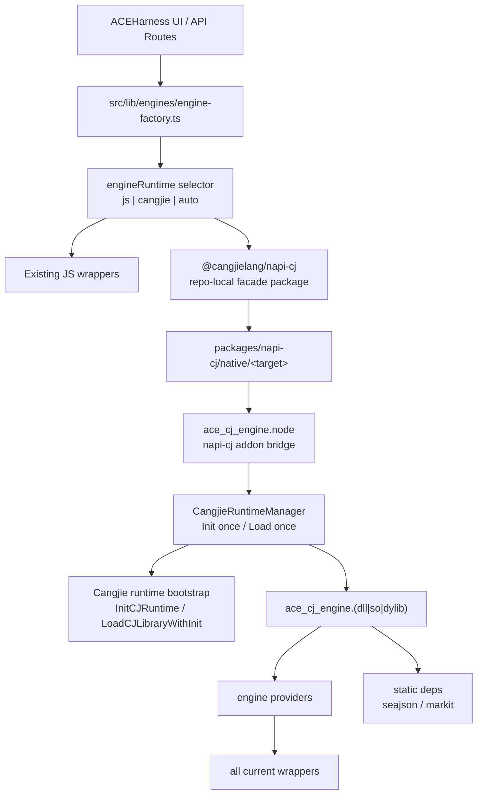
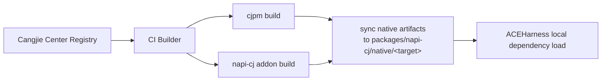

# Cangjie Runtime Engine 集成方案

## 1. 目标

 `napi-cj` 风格的 Node 集成方案。

目标如下：

- 在 JS 侧提供一个稳定的 Node 包装层，把 Cangjie engine 能力暴露给 ACEHarness。
- 在 Node 进程内初始化 Cangjie runtime，并直接调用 Cangjie 动态库。
- 明确支持 Cangjie `1.1.0+`，并支持从中心仓拉取构建依赖。
- 构建期从 Cangjie 中心仓拉取依赖，当前阶段以仓内本地依赖方式消费 native 产物。
- 支持 `js | cangjie | auto` 运行时选择，现有 JS wrapper 继续可用。
- 完成现有全部 engine wrapper 的迁移。

这里的 `napi-cj`，含义上接近 `napi-rs`：

- 对上暴露 Node 友好的 API
- 对下桥接 native runtime
- 屏蔽平台差异、二进制定位、字符串释放、回调线程切换这些细节

## 2. 核心定义

这版方案里，`napi-cj` 指的是 **JS / Node 这一侧的包装层**。

当前阶段包名固定为 `@cangjielang/napi-cj`，并作为 ACEHarness 仓库内的本地依赖使用，先不单独发布。

整体就是三段：

1. `@cangjielang/napi-cj`：仓内 JS/TS 本地包
2. `ace_cj_engine.node`：Node-API addon
3. `ace_cj_engine.(dll|so|dylib)`：Cangjie 动态库

Cangjie 侧保持简洁：

- 一个薄的 `@C` 导出层
- 一组 engine/provider 实现
- 一组 JSON / 协议 / 错误处理辅助模块

## 3. 总体架构



职责分层：

| 层 | 语言 | 职责 |
| --- | --- | --- |
| UI / API / factory | TypeScript | runtime 选择、配置、兜底、会话复用 |
| `@cangjielang/napi-cj` | TypeScript | `napi-cj` 主入口、本地 native 目录解析、addon 装载 |
| Node addon | C++ / Node-API | runtime 初始化、动态库加载、符号解析、线程桥接 |
| Cangjie dynamic library | Cangjie | engine/provider 执行、流事件、取消、结果回传 |
| Cangjie deps | Cangjie | `seajson`、`markit` |

## 4. `napi-cj` 的职责边界

`napi-cj` 只管 Node 侧包装，不吞掉 engine 本身的实现。

它负责：

1. 解析当前平台对应的本地 native 目录。
2. 加载 `.node` addon。
3. 触发 Cangjie runtime 初始化。
4. 调用 Cangjie 导出函数。
5. 把 native callback 安全转回 JS 事件。
6. 统一处理字符串释放、错误包装、构建信息读取。

它不负责：

- 重新实现 engine 逻辑
- 在 JS 侧拼装 provider 细节
- 把复杂业务状态搬回 Node 维护

这样边界很清楚：

- JS 侧 `napi-cj` 是包装层
- Cangjie 侧是实现层

## 5. 运行时选择模型

```ts
export type EngineRuntime = 'js' | 'cangjie' | 'auto';
```

建议配置：

```json
{
  "engine": "opencode",
  "driver": "stdio",
  "engineRuntime": "auto",
  "cangjieRuntime": {
    "enabled": true,
    "fallbackToJs": true,
    "engines": {
      "opencode": "auto",
      "nga": "auto",
      "codegenie": "auto",
      "codex": "auto",
      "claude-code": "auto",
      "cursor": "auto",
      "kiro-cli": "auto",
      "magic-cli": "auto",
      "trae-cli": "auto"
    }
  }
}
```

语义：

| runtime | 行为 |
| --- | --- |
| `js` | 强制走现有 JS wrapper |
| `cangjie` | 强制走 Cangjie runtime |
| `auto` | 本地 native 目标目录可用且 engine 已接入时走 Cangjie，否则走 JS |

约束：

- 是否切换 runtime，只在执行开始前决定。
- 已经进入流式执行后，不做自动重跑。
- `engineRuntime` 和 `cangjieRuntime` 直接写入当前的 engine config JSON，并通过现有 `/api/engine` 读写链路暴露给 UI。

## 6. 目录结构建议

```text
ACEHarness/
  cangjie-engine-runtime-plan.md
  vendor/
    cangjie-sdk/
      include/
        Cangjie.h
  native/
    cangjie-engine/
      cjpm.toml
      src/
        exports.cj
        protocol/
          request.cj
          response.cj
          event.cj
          build_info.cj
        engine/
          engine_registry.cj
          session_store.cj
          cancel_registry.cj
        providers/
          provider.cj
          claude_code_provider.cj
          claude_code_acp_provider.cj
          codex_provider.cj
          cursor_provider.cj
          kiro_cli_provider.cj
          magic_cli_provider.cj
          opencode_provider.cj
          opencode_sdk_provider.cj
          nga_provider.cj
          nga_sdk_provider.cj
          codegenie_provider.cj
          codegenie_sdk_provider.cj
          trae_cli_provider.cj
        utils/
          json_codec.cj
          string_alloc.cj
          errors.cj
          runtime_markdown.cj
          runtime_log.cj
    napi-cj-addon/
      binding.gyp
      src/
        addon.cc
        runtime_manager.h
        runtime_manager.cc
        engine_bridge.h
        engine_bridge.cc
        execute_worker.cc
        tsfn_stream.cc
  packages/
    napi-cj/
      package.json
      src/
        index.ts
        load-addon.ts
        resolve-binary.ts
        types.ts
        errors.ts
      native/
        win32-x64-msvc/
          ace_cj_engine.node
          ace_cj_engine.dll
          build-info.json
        darwin-arm64/
          ace_cj_engine.node
          libace_cj_engine.dylib
          build-info.json
        linux-x64-gnu/
          ace_cj_engine.node
          libace_cj_engine.so
          build-info.json
  src/
    lib/
      engines/
        cangjie-runtime-wrapper.ts
        engine-factory.ts
        engine-selection.ts
        engine-interface.ts
```

关键点：

- `packages/napi-cj` 就是 `@cangjielang/napi-cj` 的仓内落点。
- `native/napi-cj-addon` 是 Node-API bridge。
- `native/cangjie-engine` 是真正的 Cangjie 实现。

## 7. Cangjie 依赖策略

### 7.0 版本与仓库基线

这套方案的构建基线是：

- **Cangjie `1.1.0+`（支持中心仓管理仓颉侧依赖）**

### 7.1 中心仓依赖

构建期从中心仓拉取依赖，运行期不再依赖用户机器的 Cangjie 环境。

第一阶段依赖建议：

| 库 | 版本 | 角色 |
| --- | --- | --- |
| `seajson` | `1.4.7` | 必需，统一 JSON 编解码 |
| `markit` | `0.0.3` | 必需，作为 Markdown 解析与生成的核心工具 |

### 7.2 `cjpm.toml` 草案

```toml
[package]
  cjc-version = "1.1.0"
  name = "ace_cj_engine"
  version = "0.1.0"
  description = "ACEHarness Cangjie runtime engine"
  output-type = "dynamic"
  compile-option = "--static-std -Woff unused"
  override-compile-option = ""
  link-option = ""
  package-configuration = {}

[dependencies]
  seajson = { version = "1.4.7", output-type = "static" }
  markit = { version = "0.0.3", output-type = "static" }
```

原则：

- `ace_cj_engine` 输出动态库，给 Node addon 加载。
- 三方依赖尽量静态链接进 `ace_cj_engine`。
- `seajson` 、`markit` 是主路径依赖，用于 Markdown 解析、生成与文本标准化。
- `cjc-version = "1.1.0"` 表示最小构建基线

## 8. `Cangjie.h` 与 runtime 生命周期

### 8.1 头文件放置

```text
vendor/cangjie-sdk/include/Cangjie.h
```

原则：

- 头文件直接 vendored 到项目。
- CI 构建使用项目内头文件。
- SDK 升级时同步更新 `Cangjie.h`、smoke test、多平台产物。

### 8.2 runtime manager

从你给的测试样例看，正确路径是 runtime 先启动，再装载动态库。

addon 内部需要一个独立的 runtime manager：

```cpp
class CangjieRuntimeManager {
public:
  static CangjieRuntimeManager& Instance();

  bool EnsureInitialized(std::string* error);
  bool EnsureLibraryLoaded(std::string* error);
  void* ResolveSymbol(const char* name, std::string* error);
  std::string LibraryPath() const;

private:
  CangjieRuntimeManager() = default;
  std::once_flag init_flag_;
  std::once_flag load_flag_;
  bool runtime_ok_ = false;
  bool library_ok_ = false;
  RuntimeParam runtime_param_{};
  void* library_handle_ = nullptr;
};
```

启动顺序固定为：

1. `InitCJRuntime(...)`
2. `LoadCJLibraryWithInit(...)`
3. `LoadLibrary` / `dlopen`
4. `GetProcAddress` / `dlsym`
5. 调用 `ace_cj_engine_*` 导出函数

### 8.3 生命周期策略

- 整个 Node 进程中只初始化一次 runtime。
- 动态库只加载一次。
- 第一阶段不做 unload / deinit。

### 8.4 线程模型

第一阶段建议所有 Cangjie 调用都进一个 native worker 线程：

- JS 主线程只发起调用
- worker 线程进入 runtime
- stream 事件通过 `ThreadSafeFunction` 回到 JS

这样更稳，先避免 runtime 线程 attach/detach 语义不清的问题。

### 8.5 泄漏检查点

可以把内存泄漏检测直接纳入 `CangjieRuntimeManager`，但范围要限定在我们自己能闭合验证的边界。

建议增加一个仅在 debug / diagnostics 模式启用的 leak tracker：

```cpp
struct RuntimeLeakSnapshot {
  uint64_t outstanding_engine_handles = 0;
  uint64_t outstanding_c_strings = 0;
  uint64_t outstanding_request_contexts = 0;
  uint64_t outstanding_tsfn_streams = 0;
  uint64_t execute_started = 0;
  uint64_t execute_finished = 0;
  uint64_t cancel_requested = 0;
};
```

第一阶段的检查点：

1. `ace_cj_engine_create` 后 `outstanding_engine_handles +1`
2. `ace_cj_engine_destroy` 后 `outstanding_engine_handles -1`
3. 每次 Cangjie 返回 `CString` 时 `outstanding_c_strings +1`
4. `ace_cj_engine_free_string` 后 `outstanding_c_strings -1`
5. `ExecuteWorker` 创建请求上下文时 `outstanding_request_contexts +1`
6. 请求结束、异常退出、取消收尾后 `outstanding_request_contexts -1`
7. `ThreadSafeFunction` 创建 / release 前后做计数配平

检测策略：

- 在每次 `execute()` 结束后做一次 checkpoint 比对。
- 在 addon 进程退出前做一次总量比对。
- 如果 `execute_started != execute_finished`，或者若干 outstanding 计数未回零，直接打诊断日志。
- `engineRuntime=auto` 模式下，不因为泄漏告警自动切回 JS，但要把 runtime 标记为 degraded，后续可禁止复用已有 native handle。

这类检查适合当前架构，因为绝大部分资源都是单向持有、无环、生命周期明确：

- engine handle
- request context
- callback context
- returned string buffer
- TSFN

做不到的部分也要明确：

- 如果没有官方 runtime heap introspection，我们不能声称“检查了整个 Cangjie 堆是否无泄漏”。
- 第一阶段只检查 **addon 与 Cangjie ABI 边界上的可追踪资源**。

如果后续 `Cangjie.h` 或 runtime 暴露正式的内存统计接口，再把它接进 `RuntimeLeakSnapshot`。

## 9. C ABI 设计

`exports.cj` 保持很薄，只暴露 addon 需要的最小接口。

### 9.1 导出函数草案

```cangjie
package ace_cj_engine

@C
public func ace_cj_engine_create(): CPointer<Unit>

@C
public func ace_cj_engine_destroy(handle: CPointer<Unit>): Unit

@C
public func ace_cj_engine_cancel(handle: CPointer<Unit>, requestId: CString): Int32

@C
public func ace_cj_engine_free_string(ptr: CString): Unit

@C
public func ace_cj_engine_get_build_info_json(): CString

@C
public func ace_cj_engine_execute_json_with_callback(
    handle: CPointer<Unit>,
    requestJson: CString,
    emit: CFunc<(Int32, CString, CString, CPointer<Unit>) -> Unit>,
    userData: CPointer<Unit>
): CString
```

事件回调建议约定：

```text
eventType:
  1 = session
  2 = text
  3 = tool
  4 = thought
  5 = error
  6 = log
```

### 9.2 内存规则

- 所有返回到 C++ 的 `CString` 由 Cangjie 侧分配。
- C++ 用完后统一调用 `ace_cj_engine_free_string`。
- `requestJson` 的生命周期由 C++ 保证到 native 调用返回。

## 10. Cangjie 侧实现结构

### 10.1 协议对象

```cangjie
public class EngineRunOptions {
    public var agent: String = ""
    public var step: String = ""
    public var prompt: String = ""
    public var systemPrompt: String = ""
    public var model: String = ""
    public var workingDirectory: String = "."
    public var timeoutMs: Int64 = 180000
    public var sessionId: String = ""
    public var forceNewSession: Bool = false
    public var diagnosticLogging: Bool = false
}

public class EngineRunRequest {
    public var requestId: String = ""
    public var engine: String = ""
    public var driver: String = ""
    public var options: EngineRunOptions = EngineRunOptions()
}

public class EngineRunResult {
    public var success: Bool = false
    public var output: String = ""
    public var error: String = ""
    public var sessionId: String = ""
    public var stopReason: String = ""
    public var metadataJson: String = "{}"
}
```

### 10.2 provider 接口

```cangjie
public interface EngineProvider {
    func name(): String
    func supports(engine: String, driver: String): Bool
    func execute(
        request: EngineRunRequest,
        emit: (Int32, String, String) -> Unit
    ): EngineRunResult
    func cancel(requestId: String): Bool
}
```

说明：

- provider 统一接收 `EngineRunRequest`
- provider 统一输出 `EngineRunResult`
- engine registry 负责按 `engine + driver` 解析 provider

### 10.3 JSON 编解码

`seajson` 只集中在 `utils/json_codec.cj`：

```cangjie
public func decodeRequest(json: String): EngineRunRequest
public func encodeResult(result: EngineRunResult): String
public func encodeBuildInfo(): String
public func emitEventJson(kind: String, payload: String): String
```

规则：

- provider 不直接处理原始 JSON 字符串
- 协议变更尽量收敛在 codec 层

### 10.4 `markit` 的位置

`markit` 作为第一批必选依赖，直接承担 Markdown 相关核心能力：

- Markdown 解析
- Markdown 生成
- 文本块标准化
- 输出结构整理
- 后续可承接 `ace-process` 风格文本协议的统一化处理

要求：

- provider 输出给 JS 侧的 Markdown 内容优先通过 `markit` 统一整理。
- 需要结构化解析 Markdown 段落、代码块、列表时，优先走 `markit`。

## 11. Node 侧 `napi-cj` 设计

### 11.1 JS 暴露接口

```ts
export interface NativeExecuteOptions {
  engine: string;
  driver: string;
  requestJson: string;
  onEvent?: (eventType: number, contentJson: string, metadataJson: string) => void;
}

export interface CangjieAddon {
  isRuntimeAvailable(): boolean;
  execute(options: NativeExecuteOptions): Promise<string>;
  cancel(requestId: string): void;
  getBuildInfo(): string;
  getRuntimeInfo(): {
    libraryPath: string;
    initialized: boolean;
  };
}
```

### 11.2 TypeScript facade

`packages/napi-cj/src/index.ts` 负责导出稳定 API：

```ts
export function loadCangjieEngineAddon(): CangjieAddon;
export function resolveCangjieEngineNativeRoot(): string;
export type { CangjieAddon, NativeExecuteOptions } from './types';
```

### 11.3 addon 调用链

```cpp
void ExecuteWorker::Execute() {
  auto& runtime = CangjieRuntimeManager::Instance();
  if (!runtime.EnsureInitialized(&error_)) return SetError(error_);
  if (!runtime.EnsureLibraryLoaded(&error_)) return SetError(error_);

  auto fn = reinterpret_cast<ExecuteJsonWithCallbackFn>(
    runtime.ResolveSymbol("ace_cj_engine_execute_json_with_callback", &error_)
  );

  final_result_json_ = bridge_.Execute(options_, tsfn_, fn, &error_);
}
```

这里的 `engine_bridge.cc` 负责：

- 符号解析
- `CString` 生命周期
- callback 上下文
- `cancel` 与 `build-info` 调用

### 11.4 TS wrapper 接入

```ts
export class CangjieRuntimeEngineWrapper extends EventEmitter implements Engine {
  constructor(
    private readonly targetEngine: string,
    private readonly targetDriver: EngineDriver,
  ) {
    super();
  }

  async execute(options: EngineOptions): Promise<EngineResult> {
    const addon = loadCangjieEngineAddon();
    const resultJson = await addon.execute({
      engine: this.targetEngine,
      driver: this.targetDriver,
      requestJson: JSON.stringify({
        requestId: options.runId || crypto.randomUUID(),
        engine: this.targetEngine,
        driver: this.targetDriver,
        options,
      }),
      onEvent: (eventType, contentJson, metadataJson) => {
        this.emit('stream', convertNativeEvent(eventType, contentJson, metadataJson));
      },
    });

    return JSON.parse(resultJson) as EngineResult;
  }
}
```

## 12. 本地依赖与多平台产物

### 12.1 本地依赖形态

ACEHarness 根包先通过本地依赖接入：

```json
{
  "dependencies": {
    "@cangjielang/napi-cj": "file:./packages/napi-cj"
  }
}
```

`packages/napi-cj/package.json` 建议：

```json
{
  "name": "@cangjielang/napi-cj",
  "private": true,
  "main": "dist/index.js",
  "types": "dist/index.d.ts"
}
```

这样做的好处：

- 不需要先把仓库改成 monorepo 发布体系。
- `napi-cj` 能独立演进，但仍跟 ACEHarness 同仓协作。
- 等 ABI 和发布链路稳定后，再考虑是否拆出去单独发包。
- `packages/napi-cj` 先按本地构建产物使用，配套一个 package-local `tsc` build 生成 `dist/`。
- 根仓 `prepare` / `build` 需要先触发这个 package-local build，再执行主应用构建。

### 12.2 包内 native 布局

```text
packages/napi-cj/
  dist/
  native/
    win32-x64-msvc/
      ace_cj_engine.node
      ace_cj_engine.dll
      build-info.json
    darwin-arm64/
      ace_cj_engine.node
      libace_cj_engine.dylib
      build-info.json
    linux-x64-gnu/
      ace_cj_engine.node
      libace_cj_engine.so
      build-info.json
```

主包负责：

- 根据 `process.platform` / `process.arch` 解析目标目录
- 加载 `.node`
- 暴露统一 JS API

### 12.3 构建链路



顺序：

1. CI 配置中心仓凭据
2. 从中心仓拉取 `seajson` 与 `markit`
3. 构建 `ace_cj_engine` 动态库
4. 构建 `ace_cj_engine.node`
5. 把对应平台产物同步到 `packages/napi-cj/native/<target>`
6. ACEHarness 通过本地依赖直接加载 `@cangjielang/napi-cj`

### 12.4 构建信息

每个发布版本记录：

- Cangjie SDK 版本
- `Cangjie.h` 来源版本
- 中心仓依赖版本
- git commit
- 构建平台

信息写入 `build-info.json`，并通过 `ace_cj_engine_get_build_info_json()` 暴露给 JS。

## 13. 第一批改动范围

第一批适配范围按当前代码的 engine 层来定：**9 个逻辑引擎，13 个 concrete wrapper**。

| 逻辑引擎 | concrete wrapper | 当前实现类型 | driver 关系 | 第一版 Cangjie provider |
| --- | --- | --- | --- | --- |
| `claude-code` | `claude-code` | SDK wrapper | `sdk` | `claude_code_provider.cj` |
| `claude-code` | `claude-code-acp` | ACP stdio wrapper | `stdio` | `claude_code_acp_provider.cj` |
| `opencode` | `opencode` | ACP stdio wrapper | `stdio` | `opencode_provider.cj` |
| `opencode` | `opencode-sdk` | SDK / HTTP wrapper | `sdk` | `opencode_sdk_provider.cj` |
| `nga` | `nga` | ACP stdio wrapper | `stdio` | `nga_provider.cj` |
| `nga` | `nga-sdk` | SDK / HTTP wrapper | `sdk` | `nga_sdk_provider.cj` |
| `codegenie` | `codegenie` | ACP stdio wrapper | `stdio` | `codegenie_provider.cj` |
| `codegenie` | `codegenie-sdk` | SDK / HTTP wrapper | `sdk` | `codegenie_sdk_provider.cj` |
| `kiro-cli` | `kiro-cli` | ACP stdio wrapper | single | `kiro_cli_provider.cj` |
| `cursor` | `cursor` | ACP stdio wrapper | single | `cursor_provider.cj` |
| `trae-cli` | `trae-cli` | ACP stdio wrapper | single | `trae_cli_provider.cj` |
| `magic-cli` | `magic-cli` | ACP stdio wrapper | single | `magic_cli_provider.cj` |
| `codex` | `codex` | SDK / client wrapper | single | `codex_provider.cj` |

当前 driver-capable 逻辑引擎只有：

- `claude-code`
- `opencode`
- `nga`
- `codegenie`

其他 engine 没有 `sdk | stdio` driver 选择，第一版按 single wrapper 处理。

### 13.1 Cangjie 侧

- `exports.cj`
- `protocol/request.cj`
- `protocol/response.cj`
- `protocol/event.cj`
- `engine/engine_registry.cj`
- `engine/session_store.cj`
- `engine/cancel_registry.cj`
- `providers/provider.cj`
- `providers/claude_code_provider.cj`
- `providers/claude_code_acp_provider.cj`
- `providers/codex_provider.cj`
- `providers/cursor_provider.cj`
- `providers/kiro_cli_provider.cj`
- `providers/magic_cli_provider.cj`
- `providers/opencode_provider.cj`
- `providers/opencode_sdk_provider.cj`
- `providers/nga_provider.cj`
- `providers/nga_sdk_provider.cj`
- `providers/codegenie_provider.cj`
- `providers/codegenie_sdk_provider.cj`
- `providers/trae_cli_provider.cj`
- `utils/json_codec.cj`
- `utils/string_alloc.cj`
- `utils/runtime_markdown.cj`

### 13.2 Node addon 侧

- `runtime_manager.h/.cc`
- `engine_bridge.h/.cc`
- `execute_worker.cc`
- `tsfn_stream.cc`
- `addon.cc`

### 13.3 JS / TS 侧

- `src/lib/engines/index.ts`
- `src/lib/core/engine-metadata.ts`
- `src/cli.ts`
- `package.json`
- `src/app/api/engine/route.ts`
- `src/app/engines/page.tsx`
- `src/app/setup/page.tsx`
- `src/components/EngineSelect.tsx`
- `src/components/EngineModelSelect.tsx`
- `packages/napi-cj/package.json`
- `packages/napi-cj/tsconfig.json`
- `packages/napi-cj/src/index.ts`
- `packages/napi-cj/src/load-addon.ts`
- `packages/napi-cj/src/resolve-binary.ts`
- `packages/napi-cj/src/types.ts`
- `src/lib/engines/cangjie-runtime-wrapper.ts`
- `src/lib/engines/engine-factory.ts`
- `src/lib/engines/engine-interface.ts`
- `src/lib/engines/claude-code-wrapper.ts`
- `src/lib/engines/claude-code-acp-wrapper.ts`
- `src/lib/engines/codex-wrapper.ts`
- `src/lib/engines/cursor-wrapper.ts`
- `src/lib/engines/kiro-cli-wrapper.ts`
- `src/lib/engines/magic-cli-wrapper.ts`
- `src/lib/engines/opencode-wrapper.ts`
- `src/lib/engines/opencode-sdk-wrapper.ts`
- `src/lib/engines/nga-wrapper.ts`
- `src/lib/engines/nga-sdk-wrapper.ts`
- `src/lib/engines/codegenie-wrapper.ts`
- `src/lib/engines/codegenie-sdk-wrapper.ts`
- `src/lib/engines/trae-cli-wrapper.ts`
- 运行时配置读取逻辑

说明：

- 现有引擎配置页、首次安装向导、全局引擎下拉都要一起接入 `engineRuntime`。
- `compactContext` 继续保留为可选接口，第一版可以不进入 native ABI。

## 14. 测试计划

### 14.1 native smoke

- `InitCJRuntime` 成功
- `LoadCJLibraryWithInit` 成功
- `ace_cj_engine_create/destroy` 成功
- `ace_cj_engine_get_build_info_json` 返回合法 JSON

### 14.2 ABI / JSON

- request JSON -> `EngineRunRequest`
- `EngineRunResult` -> result JSON
- 非法 JSON 返回明确错误
- `ace_cj_engine_free_string` 无泄漏

### 14.3 provider 集成

- `claude-code`
- `claude-code-acp`
- `codex`
- `cursor`
- `kiro-cli`
- `magic-cli`
- `opencode + stdio`
- `opencode + sdk`
- `nga + stdio`
- `nga + sdk`
- `codegenie + stdio`
- `codegenie + sdk`
- `trae-cli`
- `cancel(requestId)` 生效
- `sessionId` 正常回传

### 14.4 JS 集成

- `engineRuntime=js` 不加载 addon
- `engineRuntime=cangjie` 走 native
- `engineRuntime=auto` 在本地 native 目标目录可用时优先走 native
- stream 事件能还原为 `EngineStreamEvent`

建议覆盖这些现有测试附近的行为：

- `tests/engine-factory-pooling.test.ts`
- `tests/engine-driver-resolution.test.ts`
- `tests/acp-wrapper-base.test.ts`
- `tests/wrapper-availability.test.ts`
- `tests/opencode-sdk-wrapper.test.ts`
- `tests/nga-sdk-wrapper.test.ts`
- `tests/codegenie-sdk-wrapper.test.ts`
- `tests/result-channel.test.ts`
- `tests/package-contract.test.ts`

## 15. 风险与控制

| 风险 | 影响 | 对策 |
| --- | --- | --- |
| `Cangjie.h` 接口非正式 | SDK 升级可能破坏启动流程 | vendored 头文件 + 固定 SDK 版本 + smoke test |
| runtime 重复 init / unload 不稳定 | 进程崩溃 | 只 init 一次，不主动 unload |
| ABI 边界资源泄漏 | 长时运行下内存增长 | `CangjieRuntimeManager` 增加 leak checkpoint 与 outstanding 计数 |
| addon / Cangjie 字符串所有权错配 | 崩溃 / 泄漏 | 统一 `ace_cj_engine_free_string` |
| 本地包缺 native 产物 | `.node` 加载失败 | `packages/napi-cj/native/<target>` 做完整性校验 |
| JSON 协议散落 | 协议演进困难 | `seajson` 收敛到 codec 模块 |
| 全量 wrapper 首批接入范围大 | 实现面扩大 | 先统一 request/result/event/markdown/取消模型，再按 wrapper family 批量接入 |

## 16. 第一阶段完成标准

- `vendor/cangjie-sdk/include/Cangjie.h` 已纳入项目
- CI 能在 Cangjie `1.1.0+` 环境下从中心仓拉取 `seajson` 和 `markit`，并构建出 `ace_cj_engine` 动态库
- `ace_cj_engine.node` 能在进程内完成 runtime 初始化并调用 `ace_cj_engine_execute_json_with_callback`
- `CangjieRuntimeManager` 已具备 debug 级 leak checkpoint 能力
- `@cangjielang/napi-cj` 已形成稳定的仓内 `napi-cj` JS 包装层
- 当前仓库里的全部 wrapper 已完成接入
- `engineRuntime=auto` 可在支持平台优先走 Cangjie runtime
- ACEHarness 根包已通过 `file:./packages/napi-cj` 方式接入本地依赖
- `packages/napi-cj/native/<target>` 产物完整并通过执行验证
