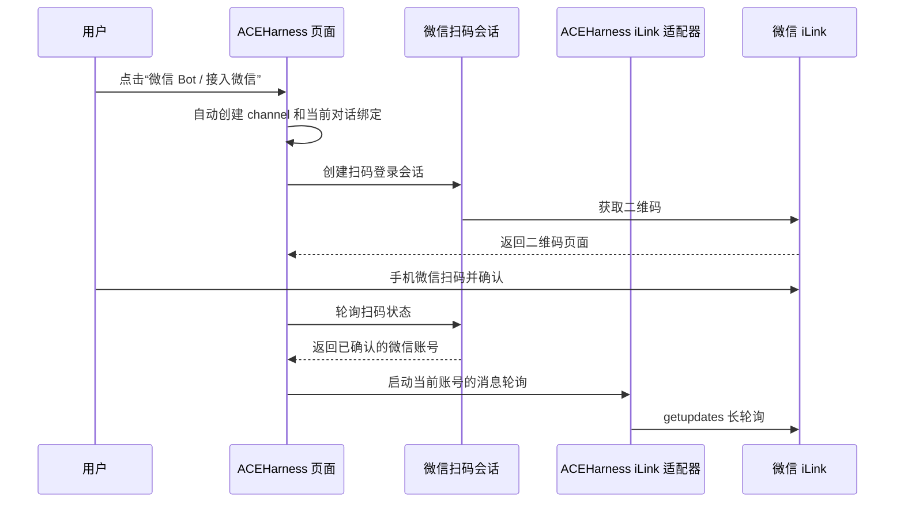
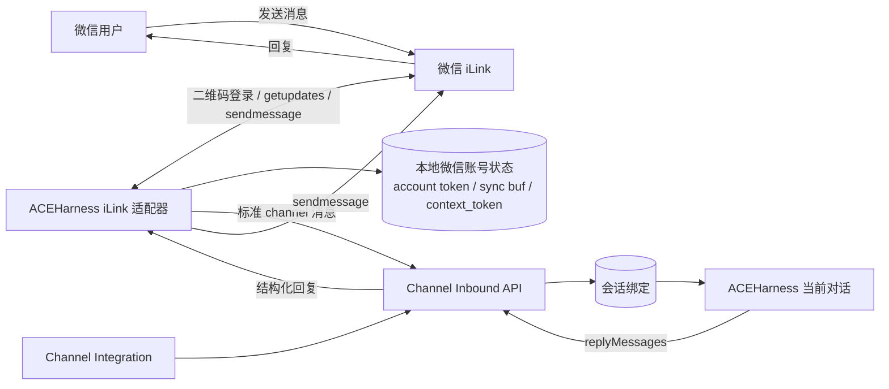
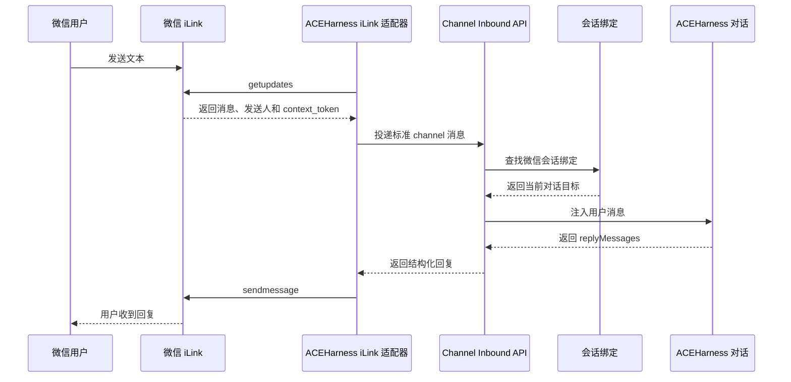
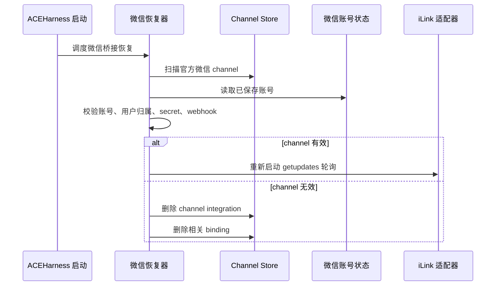

# 微信接入

ACEHarness 的微信接入由系统内置的 TypeScript iLink 适配器完成。用户侧只需要在当前对话里点击“微信 Bot / 接入微信”，然后按页面提示扫码确认。

扫码完成后，ACEHarness 会自动完成这些事情：

- 创建或复用当前用户的微信 channel integration
- 把当前首页对话绑定到这个 channel
- 保存微信账号 token、同步游标和会话 `context_token`
- 启动后台长轮询，持续接收微信消息
- 把 ACEHarness 的回复发回微信
- 在服务重启后自动恢复有效的微信轮询

## 用户流程

普通接入流程不需要填写桥接参数。页面高级排错信息中展示的内部接入参数，仅用于问题定位。

## 系统原理

微信接入分成三层：

1. iLink 适配层  
   ACEHarness 直接调用微信 iLink 接口：用二维码完成登录，用 `getupdates` 拉取文本消息，用 `sendmessage` 发送回复。

2. Channel 运行时层  
   适配器把微信消息转换成 ACEHarness 标准 channel 入站消息，投递到 `/api/channels/inbound/:integrationId`。

3. 对话绑定层  
   一个微信会话会绑定到一个 ACEHarness 对话目标。当前首页入口会把微信 channel 绑定到当前首页对话，后续微信消息继续进入同一个上下文。

## 消息收发流程

## 重启恢复

ACEHarness 启动时会恢复有效的微信接入。恢复过程会校验 channel、微信账号和用户归属，校验通过后重新启动对应账号的 `getupdates` 轮询。

恢复时会清理无效 channel，而不是只跳过。以下情况会直接删除对应的 `channel-...` 记录及其绑定：

- channel 没有绑定微信账号
- 绑定的微信账号不存在
- 微信账号没有用户归属
- 微信账号归属和 channel 创建者不一致
- 同一个微信账号已经被另一个有效 channel 恢复
- channel 缺少内部 webhook 或 secret

删除后，下次服务启动不会再检查这些已判定无效的 channel。

## 多用户规则

微信账号和 channel 都带有创建者归属：

- 扫码登录创建的微信账号会记录 `createdBy`
- channel integration 会记录 `createdBy`
- 启动桥接时会校验账号是否属于当前用户
- 恢复桥接时也会校验账号归属和 channel 归属是否一致
- 同一个进程内，一个微信账号只允许被一个 channel 轮询

这样可以避免多用户场景下 A 用户的 channel 恢复到 B 用户的微信账号，也避免同一个微信账号被多个 channel 重复拉取消息。

## 能力边界

微信接入支持文本消息闭环：扫码登录、保活、接收文本、投递到当前对话、发送文本回复。

微信接入流程不处理图片、文件、媒体上传和 typing ticket。

`scripts/wechat-bridge-relay.mjs` 和外部 webhook bridge 属于兼容能力，用于接入已有自研适配器；扫码接入不需要使用这条路径。
