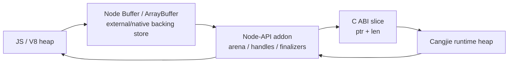

# ABI Data Plane 设计

## 1. 结论

`@cangjielang/napi-cj` 提供通用 native data plane，JSON 只承担控制面：

- runtime / build info
- library metadata
- capability negotiation
- 小体量 options
- 诊断、错误、host capability request

大文本和高频事件走 native data plane：

- JS `Buffer` / `Uint8Array`
- Node-API addon 管理的 native arena
- C ABI `pointer + length`
- versioned C struct
- binary event frame

Node 进程内直接调用 Cangjie 动态库，数据共享使用同进程 native memory。OS shared memory / mmap 适用于跨进程场景，不作为 `napi-cj` 的默认数据通道。

## 2. 内存模型

V8 heap、C++ addon native heap、Cangjie runtime heap 是不同所有权域。



规则：

- JS object 不能直接交给 Cangjie 保存。
- JS string 进入 native 前会编码成 UTF-8 `Buffer`。
- Cangjie 读取大文本时接收 `const uint8_t* + len`。
- Cangjie 不允许在 call 返回后继续持有输入 slice；跨调用保存必须复制到业务库自己的 store。
- addon 负责 request arena、event buffer、result buffer 的生命周期。
- JS 可见的 `Buffer` 必须有 finalizer 或显式 release。

## 3. ABI 分层

```text
Control plane:
  JSON strings for small structured data.

Data plane:
  napi_cj_slice for large input/output.
  napi_cj_named_slice for named inputs.
  napi_cj_event_frame for stream events.
  napi_cj_buffer_handle for returned native buffers.
```

JSON 的适用范围：

- 配置字段变化频繁，JSON schema 扩展成本低。
- 错误和诊断需要可读性。
- host capability request 不是 token 级高频路径。

数据面使用 native buffer 的原因：

- prompt / systemPrompt / Markdown 可能很大。
- JSON stringify 会产生额外转义、复制和 parse 成本。
- stream event 高频时，每个 chunk 都 JSON 编解码会放大延迟。

## 4. C ABI Contract

基础类型：

```c
#define NAPI_CJ_ABI_VERSION 1

typedef struct napi_cj_slice {
  const uint8_t* data;
  size_t len;
} napi_cj_slice;

typedef struct napi_cj_mut_slice {
  uint8_t* data;
  size_t len;
  size_t cap;
} napi_cj_mut_slice;

typedef struct napi_cj_named_slice {
  const char* name;
  napi_cj_slice bytes;
} napi_cj_named_slice;

typedef struct napi_cj_buffer_handle {
  void* ptr;
  size_t len;
  void* owner;
} napi_cj_buffer_handle;
```

data call request：

```c
typedef struct napi_cj_call_request_v1 {
  uint32_t abi_version;
  uint32_t struct_size;

  const char* request_id;
  const char* domain;
  const char* operation;

  // Small structured fields only.
  const char* options_json;

  // Large or high-frequency input payloads.
  const napi_cj_named_slice* inputs;
  size_t input_count;

  void* user_data;
} napi_cj_call_request_v1;
```

stream event frame：

```c
typedef struct napi_cj_event_frame_v1 {
  uint32_t abi_version;
  uint32_t struct_size;
  uint64_t seq;
  uint16_t kind;
  uint16_t flags;

  // UTF-8 text, markdown, tool payload, or binary payload.
  napi_cj_slice payload;

  // Small metadata only.
  const char* metadata_json;
} napi_cj_event_frame_v1;

typedef int32_t (*napi_cj_emit_frame_callback)(
  const napi_cj_event_frame_v1* frame,
  void* user_data
);
```

result：

```c
typedef struct napi_cj_call_result_v1 {
  uint32_t abi_version;
  uint32_t struct_size;
  int32_t status;

  // Small structured fields.
  const char* result_json;

  // Optional large final output.
  napi_cj_buffer_handle output;

  // Small structured error. Null on success.
  const char* error_json;
} napi_cj_call_result_v1;
```

entrypoints exported by a Cangjie business library：

```c
void* napi_cj_library_create_v1(const char* init_json);
void napi_cj_library_destroy_v1(void* library_ctx);

char* napi_cj_call_control_json_v1(
  void* library_ctx,
  const char* domain,
  const char* operation,
  const char* payload_json,
  napi_cj_host_call_callback host_call,
  napi_cj_host_free_string_callback host_free_string,
  void* user_data
);

int32_t napi_cj_call_data_v1(
  void* library_ctx,
  const napi_cj_call_request_v1* request,
  napi_cj_emit_frame_callback emit_frame,
  napi_cj_host_call_callback host_call,
  napi_cj_host_free_string_callback host_free_string,
  napi_cj_call_result_v1* result
);

void napi_cj_free_string_v1(const char* ptr);
void napi_cj_free_buffer_v1(napi_cj_buffer_handle buffer);
```

`struct_size` 用于兼容字段扩展。addon 调用前校验 `abi_version`，Cangjie 业务库也校验传入结构体大小。

## 5. TypeScript API 草案

`@cangjielang/napi-cj` 不要求业务侧直接操作 pointer。TS 侧只看到 Buffer 友好的通用 API：

```ts
export interface CangjieNativeLibrary {
  callControl(options: NativeControlCallOptions): Promise<string>;
  callData(options: NativeDataCallOptions): Promise<NativeDataCallResult>;
  dispose(): void;
}

export interface NativeDataCallOptions {
  requestId: string;
  domain: string;
  operation: string;
  optionsJson?: string;
  inputs?: Record<string, string | Buffer | Uint8Array>;
  onFrame?: (frame: NativeFrame) => void;
  onHostCall?: HostCallHandler;
}

export interface NativeFrame {
  seq: number;
  kind: number;
  flags: number;
  payload: Buffer;
  metadata?: unknown;
}
```

facade 内部把 string 转成 UTF-8 `Buffer`，再交给 addon。转换只发生一次，大文本不进入 JSON。

## 6. Event Queue 与背压

addon 中间放一个 bounded event queue：

```text
Cangjie business library
  -> emit_frame(frame)
  -> addon event queue
  -> ThreadSafeFunction
  -> JS onFrame(frame)
```

策略：

- `emit_frame` 在 native worker 线程执行。
- addon 立即复制或接管 frame payload 到 native event buffer。
- JS 主线程通过 `ThreadSafeFunction` 消费 frame。
- queue 有 high watermark / low watermark。
- 业务关键 frame 不允许静默丢弃。
- diagnostic log frame 可以在队列满时合并或丢弃，并递增 dropped counter。
- `emit_frame` 返回非 0 时，Cangjie 业务库应停止或降速。

标准模式是 `emit_frame`。高吞吐模式使用 addon-owned ring buffer：

```c
typedef int32_t (*napi_cj_reserve_frame_buffer_callback)(
  size_t requested,
  napi_cj_mut_slice* out,
  void* user_data
);

typedef int32_t (*napi_cj_commit_frame_buffer_callback)(
  const napi_cj_event_frame_v1* frame,
  void* user_data
);
```

这种模式下 Cangjie 直接写入 addon 预留的 native buffer，减少一次 payload copy。两种模式共享 frame 结构，保持 ABI 数据面稳定。

## 7. Host Bridge 数据规则

Host bridge 以 JSON 作为控制面，因为它是低频、受控 capability 调用。

host call 传大数据时，request 只放 buffer reference：

```json
{
  "id": "host-call-001",
  "capability": "workspace.readBuffer",
  "payload": {
    "bufferId": "buf-42",
    "byteOffset": 0,
    "byteLength": 1048576
  }
}
```

buffer registry 位于 addon，TS handler 只能通过受控 API 读取，不直接接触 native pointer。

## 8. Cangjie 侧数据结构

Cangjie 业务库接收通用 data call request，并在业务层把 `domain`、`operation`、named slices 解析成自己的协议对象：

```cangjie
public struct NativeInputSlice {
    public let name: String
    public let ptr: CPointer<UInt8>
    public let len: Int64
}

public class NativeDataCall {
    public var requestId: String = ""
    public var domain: String = ""
    public var operation: String = ""
    public var optionsJson: String = "{}"
    public var inputs: Array<NativeInputSlice> = []
}
```

规则：

- `options_json` 使用业务库选定的 JSON 库解码。
- Markdown / prompt 需要结构化处理时，再把 slice 转成 Cangjie String 交给业务解析器。
- 业务库不保存外部 slice。
- session store 需要保存文本时，显式 copy。

## 9. 泄漏检查扩展

`RuntimeLeakSnapshot` 覆盖 data plane：

```cpp
struct RuntimeLeakSnapshot {
  uint64_t outstanding_library_handles = 0;
  uint64_t outstanding_cj_strings = 0;
  uint64_t outstanding_cj_buffers = 0;
  uint64_t outstanding_native_buffers = 0;
  uint64_t outstanding_event_frames = 0;
  uint64_t outstanding_request_contexts = 0;
  uint64_t outstanding_tsfn_streams = 0;
  uint64_t call_started = 0;
  uint64_t call_finished = 0;
  uint64_t cancel_requested = 0;
  uint64_t frames_emitted = 0;
  uint64_t frames_dropped = 0;
};
```

检查点：

- JS input Buffer pin / unpin
- request arena create / destroy
- event buffer allocate / release
- result buffer receive / free
- frame enqueue / consume
- ring buffer reserve / commit / rollback

## 10. 性能边界

这套设计减少的是 ABI 边界成本：

- 大文本不 JSON stringify。
- Cangjie 不 JSON parse 大字段。
- stream event 不按 chunk JSON 编解码。
- result 大输出可以作为 Buffer 返回。

它不消除所有拷贝：

- JS string 转 UTF-8 Buffer 仍需要一次编码。
- Cangjie 如果要长期保存文本，需要复制。
- JS UI 最终消费文本时，Buffer 转 string 仍会发生。

因此目标是少拷贝、少 parse，而不是承诺全链路零拷贝。

## 11. 验收

- native data plane smoke 能传入 1MB payload，不经过 JSON request body。
- stream 1000 个 frame 时不发生 per-frame JSON parse。
- event queue 背压可观测。
- `napi_cj_free_buffer_v1` 与 `napi_cj_free_string_v1` 配平。
- leak snapshot 中 native buffer / event frame 计数回零。
