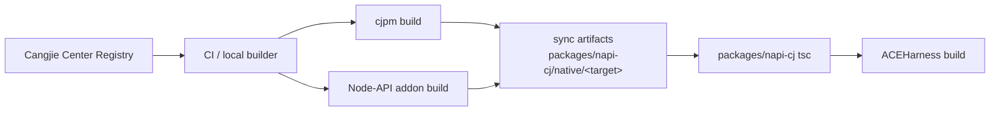

# Build 与 Packaging 设计

## 1. 当前使用方式

`@cangjielang/napi-cj` 作为仓内本地依赖，不单独发布：

```json
{
  "dependencies": {
    "@cangjielang/napi-cj": "file:./packages/napi-cj"
  }
}
```

`packages/napi-cj` 使用 package-local build 生成 `dist/`，根仓 `prepare` / `build` 在主应用构建前触发它。

## 2. 包结构

```text
packages/napi-cj/
  package.json
  tsconfig.json
  src/
    index.ts
    load-addon.ts
    resolve-binary.ts
    types.ts
    errors.ts
  dist/
  native/
    win32-x64-msvc/
      ace_cj_engine.node
      ace_cj_engine.dll
      build-info.json
    darwin-arm64/
      ace_cj_engine.node
      libace_cj_engine.dylib
      build-info.json
    linux-x64-gnu/
      ace_cj_engine.node
      libace_cj_engine.so
      build-info.json
```

## 3. Cangjie 构建

`native/cangjie-engine/cjpm.toml`：

```toml
[package]
  cjc-version = "1.1.0"
  name = "ace_cj_engine"
  version = "0.1.0"
  output-type = "dynamic"
  compile-option = "--static-std -Woff unused"

[dependencies]
  seajson = { version = "1.4.7", output-type = "static" }
  markit = { version = "0.0.3", output-type = "static" }
```

约束：

- 支持 Cangjie `1.1.0+`。
- 必须支持中心仓依赖解析。
- 中心仓只参与构建链路。
- JS 用户不需要中心仓 token、不需要本地 `cjpm`。

## 4. 构建链路



## 5. build-info

每个平台产物写入 `build-info.json`：

```json
{
  "sdkVersion": "1.1.0",
  "cangjieHeader": "vendor/cangjie-sdk/include/Cangjie.h",
  "dependencies": {
    "seajson": "1.4.7",
    "markit": "0.0.3"
  },
  "target": "win32-x64-msvc",
  "gitCommit": "...",
  "builtAt": "..."
}
```

JS 侧通过 `getBuildInfo()` 暴露。

## 6. 包契约

需要同步调整：

- root `package.json` dependencies
- root build / prepare scripts
- `tests/package-contract.test.ts`
- `.npmignore` / package `files`，确保本地依赖产物被包含或在发布阶段有明确处理

## 7. 验收

- 干净环境安装后能解析 `@cangjielang/napi-cj`。
- 当前平台 native 目录完整。
- `.node` 加载失败时错误信息可诊断。
- build-info 可读取。
- 不存在平台目录时，`engineRuntime=auto` 可以回到 JS 路径。
