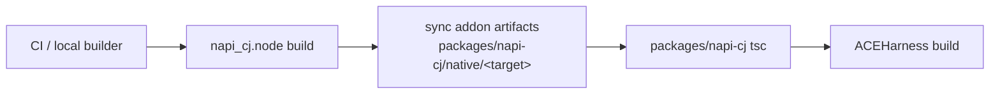

# Build 与 Packaging 设计

## 1. 使用方式

`@cangjielang/napi-cj` 作为仓内本地依赖，不单独发布：

```json
{
  "dependencies": {
    "@cangjielang/napi-cj": "file:./packages/napi-cj"
  }
}
```

`packages/napi-cj` 只发布通用 Node/Cangjie bridge。包内容包括 TS facade、Node-API addon、平台解析、错误诊断和 build-info。

## 2. 包结构

```text
packages/napi-cj/
  package.json
  tsconfig.json
  src/
    index.ts
    load-addon.ts
    resolve-addon.ts
    resolve-library.ts
    types.ts
    errors.ts
  dist/
  native/
    win32-x64-msvc/
      napi_cj.node
      build-info.json
    darwin-arm64/
      napi_cj.node
      build-info.json
    linux-x64-gnu/
      napi_cj.node
      build-info.json
```

## 3. Addon 构建

`native/napi-cj-addon` 构建 `napi_cj.node`：

```text
native/napi-cj-addon/
  binding.gyp
  src/
    addon.cc
    runtime_manager.cc
    runtime_manager.h
    library_bridge.cc
    library_bridge.h
    host_bridge.cc
    host_bridge.h
    data_call_worker.cc
    frame_queue.cc
```

约束：

- 支持 Node `>=20`。
- 支持 Cangjie `1.1.0+` runtime 初始化接口。
- 使用 vendored `vendor/cangjie-sdk/include/Cangjie.h`。
- 输出平台目录为 `packages/napi-cj/native/<target>`。
- 只链接 Node-API 和 Cangjie runtime 启动所需系统库。

## 4. 构建链路



## 5. build-info

`packages/napi-cj/native/<target>/build-info.json`：

```json
{
  "package": "@cangjielang/napi-cj",
  "addon": "napi_cj.node",
  "abiVersion": 1,
  "sdkHeader": "vendor/cangjie-sdk/include/Cangjie.h",
  "target": "win32-x64-msvc",
  "gitCommit": "...",
  "builtAt": "..."
}
```

JS 侧通过 `getAddonBuildInfo()` 暴露。

## 6. 包契约

需要同步调整：

- root `package.json` dependencies
- root build / prepare scripts
- `tests/package-contract.test.ts`
- `.npmignore` / package `files`
- npm publish 文件清单包含 `packages/napi-cj` addon 产物

## 7. 验收

- 干净环境安装后能解析 `@cangjielang/napi-cj`。
- 本平台 `napi_cj.node` 目录完整。
- addon 加载失败时错误信息可诊断。
- build-info 可读取。
- `@cangjielang/napi-cj` 不包含业务 provider、业务模型名或业务依赖。
