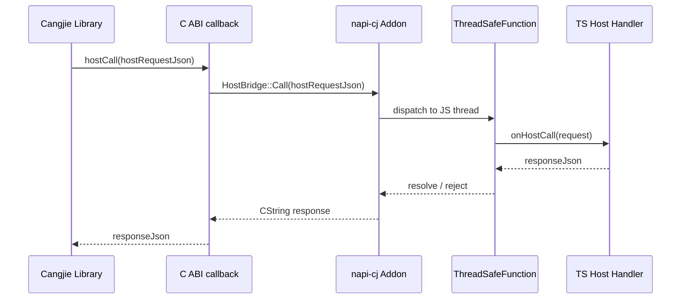

# napi-cj Host Bridge 设计

## 1. 目标

Host bridge 解决的问题是：Cangjie 业务库执行过程中，需要调用 JS/TS host 能力。

`@cangjielang/napi-cj` 提供受控调用链，Cangjie 不直接 import TS 模块：

```text
Cangjie business library
  -> C ABI callback
  -> Node-API addon HostBridge
  -> registered TS host handler
```

适合放进 host bridge 的能力：

- 读取运行时配置
- 查询 metadata、workspace 信息
- 请求 JS 侧执行已有服务能力
- 触发受控 host capability
- 记录诊断日志或调试事件

不适合放进 host bridge 的能力：

- 高频 token 流输出，流事件走 data plane `emit_frame`
- 大文件传输
- 长时间阻塞的外部进程
- 绕过权限模型的文件、网络、shell 操作

## 2. 分层边界



关键原则：

- Cangjie 只知道 JSON request / JSON response。
- addon 负责线程切换、等待、超时、错误包装。
- TS 侧只实现注册好的 host handler。
- 所有 host capability 必须走白名单。

## 3. C ABI 草案

`emit_frame` 和 `hostCall` 分开设计。

- `emit_frame`：事件流，单向、轻量、支持背压。
- `hostCall`：请求 TS 能力，有返回值、带超时、可失败。

```c
int32_t napi_cj_call_data_v1(
  void* library_ctx,
  const napi_cj_call_request_v1* request,
  napi_cj_emit_frame_callback emit_frame,
  napi_cj_host_call_callback host_call,
  napi_cj_host_free_string_callback host_free_string,
  napi_cj_call_result_v1* result
);
```

内存规则：

- data call request struct、input slice 和 `options_json` 由 addon 持有，生命周期覆盖 native 调用。
- `hostCall` 返回的 `CString` 由 addon 分配。
- Cangjie 侧必须在拷贝为 Cangjie `String` 后调用 `hostFreeString`。
- Cangjie 返回给 addon 的字符串走 `napi_cj_free_string_v1`，buffer 走 `napi_cj_free_buffer_v1`。

## 4. Host Request 协议

请求统一是 JSON：

```json
{
  "id": "host-call-001",
  "capability": "config.get",
  "timeoutMs": 3000,
  "payload": {
    "key": "runtime.mode"
  }
}
```

响应统一是 JSON：

```json
{
  "id": "host-call-001",
  "ok": true,
  "result": {
    "value": "auto"
  }
}
```

错误响应：

```json
{
  "id": "host-call-001",
  "ok": false,
  "error": {
    "code": "HOST_CAPABILITY_NOT_ALLOWED",
    "message": "Capability is not registered"
  }
}
```

默认 capability：

| capability | 用途 |
| --- | --- |
| `config.get` | 读取只读配置 |
| `metadata.get` | 查询业务 metadata |
| `model.resolve` | 查询模型配置 |
| `workspace.info` | 获取工作目录、session 信息 |
| `diagnostic.log` | 写诊断日志 |

## 5. TS API 草案

`@cangjielang/napi-cj` 暴露通用 TS 类型：

```ts
export interface HostCallRequest {
  id: string;
  capability: string;
  timeoutMs?: number;
  payload?: unknown;
}

export interface HostCallResponse {
  id: string;
  ok: boolean;
  result?: unknown;
  error?: {
    code: string;
    message: string;
    details?: unknown;
  };
}

export type HostCallHandler = (
  request: HostCallRequest
) => Promise<HostCallResponse> | HostCallResponse;

export interface NativeDataCallOptions {
  requestId: string;
  domain: string;
  operation: string;
  optionsJson?: string;
  inputs?: Record<string, string | Buffer | Uint8Array>;
  onFrame?: (frame: NativeFrame) => void;
  onHostCall?: HostCallHandler;
}
```

业务 adapter 中的使用方式：

```ts
const result = await library.callData({
  requestId,
  domain,
  operation,
  optionsJson,
  inputs: {
    primary: payload,
  },
  onFrame: (frame) => {
    emitBusinessEvent(frame);
  },
  onHostCall: async (request) => {
    return hostCapabilityRegistry.call(request);
  },
});
```

## 6. Addon 内部模型

`native/napi-cj-addon/src/` 文件结构：

```text
host_bridge.h
host_bridge.cc
host_call_context.h
host_call_context.cc
```

核心职责：

- 保存 JS `onHostCall` 的 `ThreadSafeFunction`
- 把 C ABI 的 `CString` request 转为 JS 字符串
- 在 JS 线程调用 handler
- 等待 handler 返回或 rejected
- 把结果包装成 JSON response
- 分配返回 `CString`
- 提供 `hostFreeString`

阻塞点只允许发生在 native worker 线程，不允许阻塞 JS 主线程。

## 7. 超时与取消

每个 host call 必须有超时。

选择顺序：

1. request 内 `timeoutMs`
2. data call options 的默认 host timeout
3. addon 默认值，建议 `3000ms`

取消规则：

- 如果 JS 调用 `cancel(requestId)`，addon 标记本次 data call canceled。
- 之后新的 host call 直接返回 `HOST_CALL_CANCELLED`。
- 已经派发到 JS 的 host call 等待 handler 返回或超时，不强行杀 JS 逻辑。
- Cangjie 业务库收到取消错误后应尽快停止执行。

## 8. 死锁控制

必须避免这些模式：

- JS 主线程同步等待 native，native 又同步等待 JS 主线程。
- host handler 内再次调用同一个 library call。
- host handler 长时间等待同一 data call 的最终结果。

约束：

- `callData()` 在 native worker 线程运行。
- `hostCall` 只能阻塞 native worker 线程。
- JS handler 必须是异步安全的普通函数。
- addon 对嵌套 call 做检测，发现同一 request 链路重入时返回 `HOST_REENTRANT_CALL`。

## 9. 安全与权限

Host bridge 是 Cangjie 调用 JS 能力的入口，必须默认收紧。

要求：

- capability 白名单注册。
- 默认不允许文件写入、shell、网络请求。
- 文件读取必须限定 workspace / ACEHarness data 目录。
- 所有错误响应不得泄漏 token、环境变量、完整密钥。
- diagnostic log 默认脱敏。

不开放任意 JS eval、任意 module import、任意 shell。

## 10. Cangjie 侧使用示意

```cangjie
public func callHostConfigGet(
    hostCall: CFunc<(CString, CPointer<Unit>) -> CString>,
    hostFreeString: CFunc<(CString, CPointer<Unit>) -> Unit>,
    userData: CPointer<Unit>,
    key: String
): String {
    let request = encodeHostRequest("config.get", key)
    let responsePtr = hostCall(request.toCString(), userData)
    let response = copyCStringToString(responsePtr)
    hostFreeString(responsePtr, userData)
    return response
}
```

规则：

- Cangjie 业务库不直接拼接复杂 JSON。
- host request / response 编解码集中到业务库的 protocol 层。
- host call 错误转换成业务错误或 diagnostic event。

## 11. 测试计划

Native / addon：

- host callback 未注册时返回明确错误。
- sync handler 正常返回。
- async handler 正常返回。
- handler reject 转成 JSON 错误。
- timeout 生效。
- cancel 后新 host call 直接失败。
- `hostFreeString` 计数配平，无 outstanding string。

JS 集成：

- native library wrapper 能注册 `onHostCall`。
- `config.get` 能读取只读配置。
- `diagnostic.log` 不影响 data call 结果。
- host handler 不能触发同 request 的递归 call。

## 12. 边界

host bridge 的最小闭环：

- `diagnostic.log`
- `config.get`
- `metadata.get`

边界外：

- 任意 tool execution
- 大文件传输
- shell / network host capability
- Cangjie 侧直接调用 TS 模块
