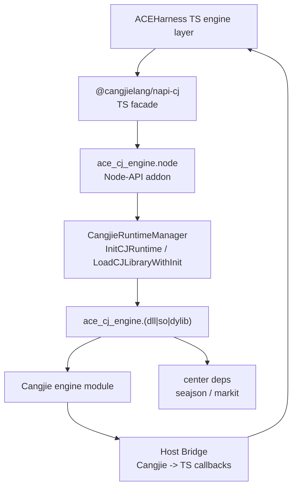

# napi-cj 完整概述

## 1. 目标

`napi-cj` 是 ACEHarness 中的 Node 到 Cangjie runtime 桥接层，形态接近 `napi-rs`。

它的目标是：

- 在 JS/TS 侧提供稳定的 `@cangjielang/napi-cj` 本地包。
- 在 Node 进程内初始化 Cangjie runtime，并调用 Cangjie 动态库。
- 支持 Cangjie `1.1.0+` 和中心仓构建依赖。
- 承接 engine wrapper 的 native 执行路径。
- 保留 JS 侧可配置兜底路径，按 engine 配置控制是否启用 Cangjie runtime。

当前作为仓内本地依赖使用：

```json
{
  "dependencies": {
    "@cangjielang/napi-cj": "file:./packages/napi-cj"
  }
}
```

## 2. 分层



职责边界：

| 层 | 职责 |
| --- | --- |
| ACEHarness TS engine layer | 决定是否启用 Cangjie、处理现有业务接口、保留 JS fallback |
| `@cangjielang/napi-cj` | 加载本地 native 产物、暴露统一 TS API、转发事件和 host callback |
| Node-API addon | 初始化 runtime、加载动态库、解析 C ABI、处理线程和内存 |
| Cangjie dynamic library | 实现 engine 核心逻辑 |
| Host bridge | 让 Cangjie 受控调用 TS/JS host 能力 |

## 3. Engine 迁移模型

`napi-cj` 当前承接 engine wrapper 层的 native 执行能力。

| 领域 | 文档 | 覆盖范围 |
| --- | --- | --- |
| engine | [modules/engine-design.md](modules/engine-design.md) | 覆盖 9 个逻辑引擎、13 个 concrete wrapper |

engine 模块遵守：

- TS 接口先不大改。
- Cangjie 实现通过 JSON ABI 暴露。
- 模块内自己定义 request/result/event 协议。
- 高风险能力保留 JS fallback。
- host bridge 只开放白名单能力。

## 4. 目录结构

```text
ACEHarness/
  docs/
    napi-cj/
      README.md
      overview.md
      foundation/
        runtime-bridge-design.md
        host-bridge-design.md
        build-packaging-design.md
      modules/
        engine-design.md
      roadmap/
        migration-roadmap.md
  vendor/
    cangjie-sdk/
      include/
        Cangjie.h
  native/
    napi-cj-addon/
      binding.gyp
      src/
        addon.cc
        runtime_manager.cc
        runtime_manager.h
        module_bridge.cc
        module_bridge.h
        host_bridge.cc
        host_bridge.h
        execute_worker.cc
        tsfn_stream.cc
    cangjie-engine/
      cjpm.toml
      src/
        exports.cj
        protocol/
        modules/
          engine/
        utils/
  packages/
    napi-cj/
      package.json
      tsconfig.json
      src/
        index.ts
        load-addon.ts
        resolve-binary.ts
        types.ts
        errors.ts
      native/
        win32-x64-msvc/
        darwin-arm64/
        linux-x64-gnu/
```

## 5. 通用调用形态

TS 侧：

```ts
const resultJson = await addon.callModule({
  module: 'engine',
  operation: 'execute',
  requestJson,
  onEvent,
  onHostCall,
});
```

C ABI 侧：

```c
char* ace_cj_call_module_json_with_host_callback(
  void* handle,
  const char* module,
  const char* operation,
  const char* request_json,
  emit_callback emit,
  host_call_callback host_call,
  host_free_string_callback host_free_string,
  void* user_data
);
```

TS facade 暴露 `callModule`，engine wrapper 通过 `module=engine` 和 `operation=execute` 调用 Cangjie provider。

## 6. 关键原则

- Cangjie 侧优先使用 `seajson` 做 JSON 编解码。
- `markit` 是必选依赖，用于 Markdown 解析、生成和文本标准化。
- `Cangjie.h` vendored 到项目，并和 SDK 版本一起锁定。
- runtime 在 Node 进程内只初始化一次。
- 生产环境不主动 unload Cangjie runtime。
- Debug / diagnostics 模式下启用 ABI 边界泄漏检查。
- TS host callback 默认收紧，必须走 capability 白名单。

## 7. 完成标准

- `packages/napi-cj` 本地包可被 ACEHarness 根包加载。
- `native/napi-cj-addon` 能初始化 Cangjie runtime。
- `native/cangjie-engine` 能通过 C ABI 执行至少一个 engine operation。
- host bridge 能完成 `diagnostic.log`、`config.get`、`engine.metadata` 最小闭环。
- engine 模块完成当前 13 个 concrete wrapper 的 Cangjie provider 接入。
