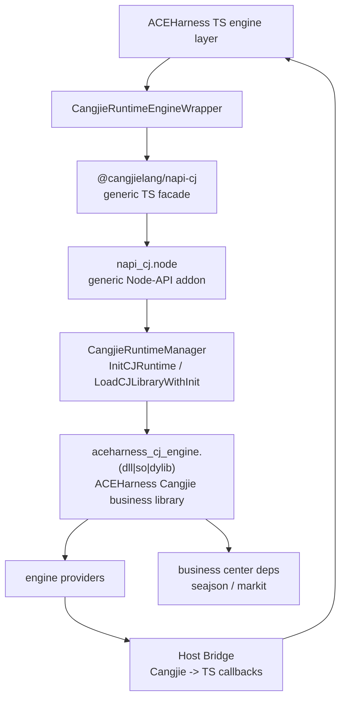

# napi-cj 完整概述

## 1. 目标

`@cangjielang/napi-cj` 是 Node 到 Cangjie runtime 的通用桥接库，形态接近 `napi-rs`。

它的目标是：

- 在 JS/TS 侧提供稳定的 Cangjie native library 加载 API。
- 在 Node 进程内初始化 Cangjie runtime，并加载 Cangjie 动态库。
- 提供通用 C ABI、native buffer、event frame、host callback、泄漏检查能力。
- 支持 Cangjie `1.1.0+`。
- 不包含 ACEHarness engine provider、wrapper 逻辑、业务依赖和业务协议。

ACEHarness 的 engine 迁移由独立 Cangjie 业务库 `aceharness-cj-engine` 承接。`@cangjielang/napi-cj` 只负责把该业务库接入 Node 进程。

采用仓内本地依赖：

```json
{
  "dependencies": {
    "@cangjielang/napi-cj": "file:./packages/napi-cj"
  }
}
```

## 2. 分层



职责边界：

| 层 | 职责 |
| --- | --- |
| ACEHarness TS engine layer | 决定是否启用 Cangjie、处理 engine 业务接口、提供 JS fallback |
| `CangjieRuntimeEngineWrapper` | 把 ACEHarness `Engine` 接口映射到 `napi-cj` 通用调用 |
| `@cangjielang/napi-cj` | 加载 native addon、加载 Cangjie 业务库、暴露通用 TS API、转发 event frame 和 host callback |
| `napi_cj.node` | 初始化 runtime、加载动态库、解析通用 C ABI、管理线程和内存 |
| `aceharness-cj-engine` | 实现 ACEHarness engine provider、request/result/event 业务协议 |
| Host bridge | 让 Cangjie 受控调用 TS/JS host 能力 |

`@cangjielang/napi-cj` 不依赖 `seajson`、`markit`，也不包含任何 ACEHarness engine 名称。`seajson`、`markit` 是 `aceharness-cj-engine` 的 Cangjie 业务依赖。

## 3. Engine 接入模型

`napi-cj` 暴露通用 native call 能力；ACEHarness engine adapter 在 TS 侧绑定业务语义。

| 领域 | 文档 | 覆盖范围 |
| --- | --- | --- |
| napi base | [foundation/runtime-bridge-design.md](foundation/runtime-bridge-design.md) | runtime、loader、C ABI、buffer、event frame、host callback |
| engine business | [modules/engine-design.md](modules/engine-design.md) | 9 个逻辑引擎、13 个 concrete wrapper |

engine adapter 遵守：

- TS `Engine` 接口保持兼容。
- JSON 只作为控制面，engine 大文本和高频事件走 native data plane。
- ACEHarness engine request/result/event 协议定义在 `aceharness-cj-engine`。
- JS fallback 由 engine runtime 配置控制。
- host bridge 只开放白名单能力。

## 4. 目录结构

```text
ACEHarness/
  docs/
    napi-cj/
      README.md
      overview.md
      foundation/
        runtime-bridge-design.md
        abi-data-plane-design.md
        host-bridge-design.md
        build-packaging-design.md
      modules/
        engine-design.md
      roadmap/
        migration-roadmap.md
  vendor/
    cangjie-sdk/
      include/
        Cangjie.h
  native/
    napi-cj-addon/
      binding.gyp
      src/
        addon.cc
        runtime_manager.cc
        runtime_manager.h
        library_bridge.cc
        library_bridge.h
        host_bridge.cc
        host_bridge.h
        data_call_worker.cc
        frame_queue.cc
    aceharness-cj-engine/
      cjpm.toml
      src/
        exports.cj
        protocol/
        modules/
          engine/
        utils/
      artifacts/
        win32-x64-msvc/
        darwin-arm64/
        linux-x64-gnu/
  packages/
    napi-cj/
      package.json
      tsconfig.json
      src/
        index.ts
        load-addon.ts
        resolve-addon.ts
        resolve-library.ts
        types.ts
        errors.ts
      native/
        win32-x64-msvc/
          napi_cj.node
          build-info.json
        darwin-arm64/
          napi_cj.node
          build-info.json
        linux-x64-gnu/
          napi_cj.node
          build-info.json
```

## 5. 通用调用形态

控制面使用 JSON：

```ts
const resultJson = await library.callControl({
  domain: 'runtime',
  operation: 'probe',
  payloadJson: JSON.stringify({ detail: true }),
  onHostCall,
});
```

数据面使用 named buffer：

```ts
const result = await library.callData({
  domain: 'engine',
  operation: 'execute',
  requestId,
  optionsJson: JSON.stringify({
    engine,
    driver,
    model,
    workingDirectory,
    timeoutMs,
    sessionId,
  }),
  inputs: {
    prompt: Buffer.from(prompt, 'utf8'),
    systemPrompt: Buffer.from(systemPrompt, 'utf8'),
  },
  onFrame: (frame) => {
    this.emit('stream', convertEngineFrame(frame));
  },
  onHostCall,
});
```

C ABI 控制面入口：

```c
char* napi_cj_call_control_json_v1(
  void* library_ctx,
  const char* domain,
  const char* operation,
  const char* payload_json,
  napi_cj_host_call_callback host_call,
  napi_cj_host_free_string_callback host_free_string,
  void* user_data
);
```

C ABI 数据面入口：

```c
int32_t napi_cj_call_data_v1(
  void* library_ctx,
  const napi_cj_call_request_v1* request,
  napi_cj_emit_frame_callback emit_frame,
  napi_cj_host_call_callback host_call,
  napi_cj_host_free_string_callback host_free_string,
  napi_cj_call_result_v1* result
);
```

详细设计见 [foundation/abi-data-plane-design.md](foundation/abi-data-plane-design.md)。

## 6. 关键原则

- `@cangjielang/napi-cj` 是通用桥接库，不包含 ACEHarness 业务代码。
- 业务动态库实现 `napi_cj_*` C ABI contract。
- Cangjie 业务库使用 `seajson` 做控制面 JSON 编解码。
- Cangjie 业务库使用 `markit` 做 Markdown 解析、生成和文本标准化。
- `Cangjie.h` vendored 到项目，并和 SDK 版本一起锁定。
- runtime 在 Node 进程内只初始化一次。
- 大文本通过 `Buffer` / `pointer + length` 传递，避免 JSON 编解码热路径。
- 生产环境不主动 unload Cangjie runtime。
- Debug / diagnostics 模式下启用 ABI 边界泄漏检查。
- TS host callback 默认收紧，必须走 capability 白名单。

## 7. 完成标准

- `packages/napi-cj` 本地包可被 ACEHarness 根包加载。
- `native/napi-cj-addon` 能初始化 Cangjie runtime。
- `@cangjielang/napi-cj` 能加载外部 Cangjie 业务动态库。
- `aceharness-cj-engine` 能通过 `napi_cj_*` C ABI 执行 engine operation。
- host bridge 能完成 `diagnostic.log`、`config.get`、`engine.metadata` 最小闭环。
- engine 模块完成 13 个 concrete wrapper 的 Cangjie provider 接入。
