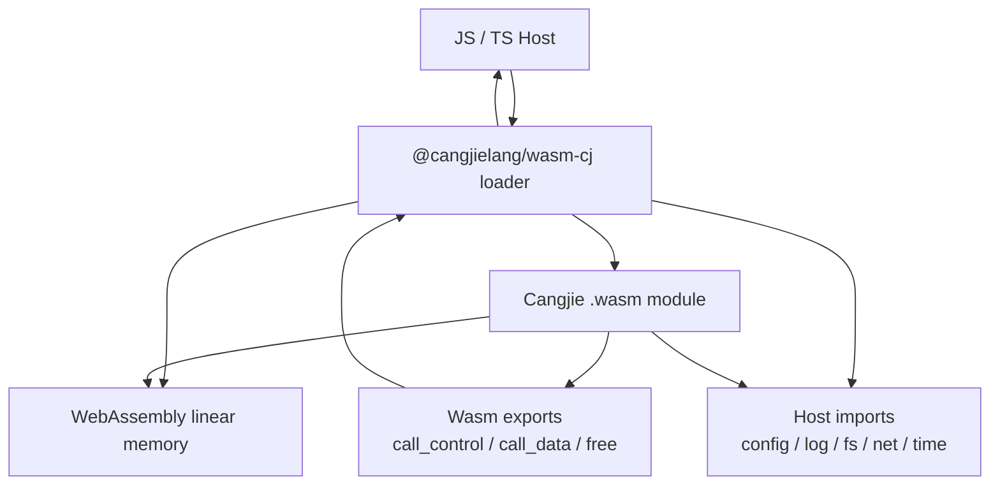

# wasm-cj 互操作设计

## 1. 总体模型

`wasm-cj` 互操作采用三层模型：



JS host 拥有权限；Cangjie wasm module 只通过 import capability 访问外部世界。

## 2. Export ABI

wasm module 导出稳定函数：

```c
int32_t wasm_cj_init(uint32_t init_ptr, uint32_t init_len);

int32_t wasm_cj_call_control(
  uint32_t domain_ptr,
  uint32_t domain_len,
  uint32_t operation_ptr,
  uint32_t operation_len,
  uint32_t payload_ptr,
  uint32_t payload_len,
  uint32_t result_handle_ptr
);

int32_t wasm_cj_call_data(
  uint32_t request_ptr,
  uint32_t request_len,
  uint32_t result_handle_ptr
);

void wasm_cj_free(uint32_t ptr, uint32_t len);
```

所有 pointer 都是 wasm linear memory offset。JS 侧通过 `WebAssembly.Memory` 读写。

## 3. Import ABI

host imports：

```ts
export interface WasmCjImports {
  host_log(level: number, ptr: number, len: number): void;
  host_call(reqPtr: number, reqLen: number, resultHandlePtr: number): number;
  host_now_ms(): bigint;
  host_random(ptr: number, len: number): number;
  host_read_buffer(handle: number, offset: number, len: number, outPtr: number): number;
  host_release_handle(handle: number): void;
}
```

capability registry：

```ts
const runtime = await loadWasmCj({
  wasmPath,
  capabilities: {
    'diagnostic.log': diagnosticLog,
    'config.get': configGet,
    'workspace.read': workspaceRead,
  },
});
```

## 4. 数据互操作

小结构化数据：

- JSON string 写入 wasm memory。
- wasm 返回 result handle。
- JS 读取 result bytes 并释放。

大数据：

- JS 维护 host buffer table。
- wasm request 中传 buffer handle、offset、length。
- wasm 通过 `host_read_buffer` 分段读取。
- wasm 输出大数据时返回 wasm memory slice 或 host handle。

事件流：

- wasm 写 event frame 到 ring buffer。
- JS host poll 或通过 callback import 拉取。
- Node 环境可用同步 callback。
- 浏览器环境使用 cooperative polling，避免阻塞主线程。

## 5. 异步互操作

WebAssembly import 默认同步。异步 host call 有三种模型：

| 模型 | 说明 | 适用场景 |
| --- | --- | --- |
| Polling | wasm 发起 request handle，JS 异步处理，wasm 轮询结果 | 浏览器兼容性好 |
| Asyncify | 编译期插桩暂停/恢复 wasm 栈 | 开发体验好，工具链复杂 |
| Worker RPC | wasm 跑在 Worker，JS host 通过消息协议返回 | UI 隔离好，延迟更高 |

基线模型采用 Polling：

```text
wasm call host_start(request) -> handle
wasm periodically host_poll(handle)
JS resolves handle
wasm reads response
```

## 6. ACEHarness 互操作

ACEHarness 可提供三种 runtime：

```ts
export type EngineRuntime = 'js' | 'cangjie' | 'wasm' | 'auto';
```

执行选择：

| runtime | 行为 |
| --- | --- |
| `js` | 使用现有 JS wrapper |
| `cangjie` | 使用 `napi-cj` + native Cangjie 业务库 |
| `wasm` | 使用 `wasm-cj` + Cangjie wasm module |
| `auto` | 按平台能力和 provider 支持度选择 |

engine adapter：

```ts
const result = await wasmRuntime.callData({
  domain: 'engine',
  operation: 'execute',
  optionsJson,
  inputs: {
    prompt,
    systemPrompt,
  },
  onFrame,
  onHostCall,
});
```

## 7. 安全边界

- wasm module 不直接访问文件系统、网络、shell。
- 所有 host capability 必须注册。
- buffer handle 不暴露原始 JS object。
- host response 需要 size limit。
- diagnostic log 默认脱敏。
- browser host 与 Node host 使用不同 capability policy。

## 8. 性能边界

优势：

- wasm module 跨平台分发。
- 浏览器可运行。
- 沙箱隔离强。
- 纯计算和文本处理性能稳定。

限制：

- wasm 与 JS 之间仍有 memory copy。
- 异步 host call 成本高于 native callback。
- 大量细粒度 host call 会拖慢执行。
- 完整 Cangjie runtime 语义会显著增加 wasm 体积和启动时间。

## 9. 与 napi-cj 的关系

`napi-cj` 和 `wasm-cj` 共享高层协议：

- `callControl`
- `callData`
- `optionsJson`
- named inputs
- event frame
- host capability registry

两者不共享底层 ABI：

- `napi-cj` 使用 native pointer、dynamic library、Node-API。
- `wasm-cj` 使用 wasm memory offset、import/export、host buffer handle。

ACEHarness TS adapter 通过统一 runtime interface 屏蔽差异。
