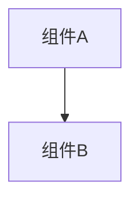

# ACEHarness Spec Coding

将粗需求转化为可审查、可实现、可验证的正式规范制品，并在实现阶段按规范推进。

## 制品体系

| 制品 | 用途 | 质量标准 |
| --- | --- | --- |
| `requirements.md` | 用户故事 + 验收标准 | 每个需求有用户故事 + WHEN/THEN 验收标准 |
| `design.md` | 架构 + 接口 + 关键决策 | Mermaid 架构图 + 关键决策表 |
| `tasks.md` | 多级嵌套实现计划 | 多级 checkbox + 需求追溯 + 检查点 |

## 工作流程

### 阶段 1：需求文档 (requirements.md)

**输入：** 用户需求描述、已有代码上下文

**过程：**
1. 从用户输入和代码中提取已知事实
2. 针对会改变实现和验收的关键问题进行访谈
3. 将需求结构化为用户故事 + WHEN/THEN 验收标准

**输出格式（必须严格遵循）：**

```markdown
# 需求文档：<项目名称>

## 需求

### 需求 1：<需求名称>

**用户故事：** 作为<角色>，我希望<目标>，以便<价值>。

#### 验收标准

1. WHEN <条件> THEN <预期行为>
2. WHEN <条件> THEN <预期行为>

### 需求 2：<需求名称>

**用户故事：** 作为<角色>，我希望<目标>，以便<价值>。

#### 验收标准

1. WHEN <条件> THEN <预期行为>
2. WHEN <条件> THEN <预期行为>
```

⚠️ 关键格式要求：
- 第一行必须是 `# 需求文档：<名称>`
- `## 需求` 必须独占一行
- 每个需求用 `### 需求 N：<名称>` 格式
- 每个需求包含 `**用户故事：**` 和 `#### 验收标准`（独占一行）
- 验收标准用 `WHEN ... THEN ...` 格式

### 阶段 2：设计文档 (design.md)

**输入：** `requirements.md`

**输出格式（必须严格遵循）：**

```markdown
# 设计文档：<项目名称>

## 概述

<核心设计原则>



## 关键决策

| 决策 | 选择 | 理由 | 替代方案 |
| --- | --- | --- | --- |
| <决策1> | <选择> | <理由> | <替代方案> |
```

⚠️ 关键格式要求（**每条都是硬性要求，缺一不可**）：
- 第一行必须是 `# 设计文档：<名称>`
- `## 概述` 必须独占一行
- **必须包含 ` ```mermaid ` 代码块（architecture/sequence/flowchart 均可，不可省略）**
- `## 关键决策` 必须独占一行，后跟 `| 决策 | 选择 | 理由 | 替代方案 |` 表格

❌ 绝对禁止：design.md 中没有 ` ```mermaid ` 代码块

### 阶段 3：实现计划 (tasks.md)

**输入：** `requirements.md` + `design.md`

**输出格式（必须严格遵循）：**

```markdown
# 实现计划：<项目名称>

## 任务

- [ ] T1 <顶层任务标题>
  - [ ] T1.1 <子任务标题>
    - <具体步骤描述>
    - _需求：T1_

  - [ ] T1.2 <子任务标题>
    - <具体步骤描述>
    - _需求：T1_

- [ ] T2 检查点 - <验证描述>
  - 确保所有测试通过

- [ ] T3 <顶层任务标题>
  - [ ] T3.1 <子任务标题>
    - _需求：T2_

- [ ] T4 检查点 - 最终验证
  - 确保所有功能正常
```

⚠️ 关键格式要求：
- 第一行必须是 `# 实现计划：<名称>`
- `## 任务` 必须独占一行
- 任务编号必须用 T 前缀：`T1`、`T1.1`、`T2.3`（**不要用** `1.` 这种带尾部句点的格式）
- 所有 checkbox 行格式：`- [ ] T编号 标题`
- 子任务缩进 2 空格
- 每组子任务下方有 `_需求：Tx_` 引用
- 必须包含至少一个检查点任务（标题含"检查点"二字）

## 需求访谈

在写制品之前，先从上下文推断已知事实，再针对性提问。

**核心维度：**
1. **目标与价值：** 谁需要这个变化，成功后可观察结果是什么
2. **当前行为与目标行为：** 现在如何运行，目标如何变化
3. **范围与非目标：** 本次包含和排除什么
4. **兼容与迁移：** 旧数据、旧配置是否需要继续可用
5. **验证方式：** 用什么方式证明完成

**提问原则：**
- 先吸收用户已说过的内容，不重复提问
- 只问会影响实现策略或验收标准的问题
- 给具体选项并允许补充，只询问业务相关问题
- 每个问题说明它会影响哪类决策

## 目录结构

```
specs/<domain>/
├── requirements.md
├── design.md
└── tasks.md
```

## 持久化 Spec 模式

当工作流配置 `specCoding.persistMode: 'repository'` 时，spec 制品持久化到仓库 `specCoding.specRoot` 指定的目录（默认 `<workingDirectory>/.spec`）。

### 目录结构
- `<specRoot>/spec.md` — 总 spec（master，输入文件）
- `<specRoot>/checklist.md` — 预存问题清单（输入文件）
- `<specRoot>/specs/<workflowName>-<runId>/` — 每次运行的 delta 快照

### AI 规则
- **审查时**：检查 `checklist.md`，所有未回答问题（`- [ ]`）需要在审批时提出
- **修订制品时**：直接更新 artifacts 正文，保持三份制品之间的术语、范围和需求追溯一致

## AI 输出的 `<result>` JSON 格式

当 AI 生成 spec-coding 草案时，输出必须放在 `<result>` 标签内：

```
<result>
{"kind":"plan_draft","payload":{"summary":"一句话概括","goals":["目标"],"artifacts":{"requirements":"requirements.md 全文","design":"design.md 全文","tasks":"tasks.md 全文"}}}
</result>
```

### 关键字段说明

| 字段 | 类型 | 必填 | 说明 |
|------|------|------|------|
| `kind` | string | 是 | 固定为 `"plan_draft"` |
| `payload.summary` | string | 是 | 项目一句话概括 |
| `payload.goals` | string[] | 是 | 目标列表 |
| `payload.artifacts.requirements` | string | 是 | requirements.md 完整内容 |
| `payload.artifacts.design` | string | 是 | design.md 完整内容 |
| `payload.artifacts.tasks` | string | 是 | tasks.md 完整内容 |

### 制品内容校验规则

三份 artifacts 必须通过以下校验：

- **requirements**: `# 需求文档：<名称>` + `## 需求`（独占一行）+ `### 需求 N：` + `**用户故事：**` + `#### 验收标准`（独占一行）+ `WHEN...THEN...`
- **design**: `# 设计文档：<名称>` + `## 概述`（独占一行）+ ` ```mermaid ` 代码块 + `## 关键决策`（独占一行）+ 表格行
- **tasks**: `# 实现计划：<名称>` + `## 任务`（独占一行）+ `- [ ] T编号 标题` + `  - [ ] T编号.子编号 子任务` + `_需求：Tx_` + 含"检查点"的任务
