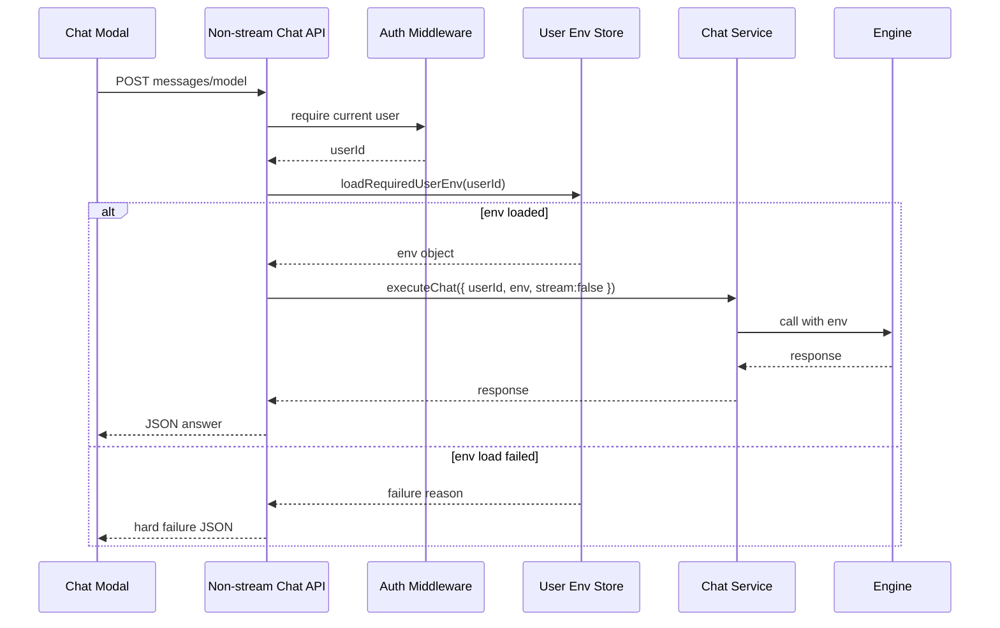

# 正向示例：工程型可执行 Spec

这个示例展示“好 spec”需要达到的执行粒度：能让后续 AI 直接改代码、补测试、跑回归，而不是只知道大概方向。

不要照抄业务内容。要模仿的是：

- 从用户原话中提取硬约束、失败策略、兼容范围和测试面。
- 把需求写成可观察行为，不写“优化”“完善”“支持一下”。
- 设计要落到模块、接口、数据流、错误传播、兼容策略。
- 任务要指出具体文件/函数/测试落点，leaf task 能交给单个 Agent 执行。

## 输入

用户说：

> 看下 chat modal 调用的 chat 接口，非 stream 模式现在会用用户个人环境变量吗？没传的话要硬失败，然后 env 必须都透传进去。

已知上下文：

- Chat modal 同时可能走 stream 和 non-stream 调用。
- 用户有个人环境变量配置，应该影响 engine/chat 调用。
- 本次只要求修 non-stream chat 接口，不扩大到 unrelated workflow 执行链。
- 安全要求：不能把其他用户的个人 env 混入当前请求。

## 生成前分析示例

这部分是 spec 的核心，不是可选说明。AI 必须先把用户请求压成可执行事实，再写 requirements/design/tasks。

### 1. 用户原话拆解

| 原话片段 | 含义 | 约束类型 | 必须落到哪里 |
| --- | --- | --- | --- |
| "chat modal 调用的 chat 接口" | 入口是首页/Chat Modal 使用的 `/api/chat` 非 stream route | 范围约束 | requirements 非目标、design 组件、tasks T1 |
| "非 stream 模式" | 本次目标不是 `/api/chat/stream` SSE 路径，但要对比行为一致性 | 兼容约束 | R3、D3、回归测试 |
| "现在会用用户个人环境变量吗" | 需要先查当前实现，不能直接假设 | 证据要求 | 代码证据 E1-E4、T1 调研任务 |
| "没传的话要硬失败" | 无法确认用户 env 已加载时不能继续 engine 调用 | 行为要求 | R2、错误矩阵、route 测试 |
| "env 必须都透传进去" | 所有 enabled user env key/value 必须进入 engine execution context，不能过滤未知 key | 数据契约 | R3、D2、engine mock 断言 |

### 2. 当前代码证据

| 编号 | 文件/函数 | 观察到的事实 | 推导 |
| --- | --- | --- | --- |
| E1 | `src/app/api/chat/route.ts` `POST` | route 已调用 `requireAuth(request)`，并把 `auth.id` 传给 `executeEngineWithContextRecovery` 的 `userId` 字段；没有显式调用 `loadEnvVars` 或传 `env`。 | 已有用户身份，但 non-stream env 透传链路不完整，支撑 R1/R2/R3。 |
| E2 | `src/app/api/chat/stream/route.ts` `POST` | stream route 同样通过 `requireAuth` 获取 `auth.id`，使用 `getOrCreateEngine(..., auth.id)`，执行时传 `userId: auth.id`。 | stream 路径是兼容参照，但不能随意改 response shape，支撑 R3。 |
| E3 | `src/lib/core/env-manager.ts` `loadEnvVars` / `buildEnvObject` | env 支持 `scope: 'user' | 'merged'` 和 `userId`，`buildEnvObject` 只保留 enabled 且 value 非空的变量。读取失败现在会返回空数组，无法区分“成功为空”和“读取失败”。 | 需要硬失败语义时不能直接把 `loadEnvVars(...user)` 的空数组当成功，支撑 R2/D2。 |
| E4 | `tests/api-chat-route.test.ts` | 现有测试已 mock `requireAuth`、`executeEngineWithContextRecovery`，断言认证失败不调用 engine，断言 execute 参数包含 `userId`。 | 可在该测试文件扩展 env 透传和硬失败断言，支撑 T4。 |

### 3. 当前行为与目标行为

| 场景 | 当前行为 | 目标行为 | 验证方式 |
| --- | --- | --- | --- |
| 已认证用户 non-stream chat | route 传 `userId`，但没有显式 env object | route 加载当前用户 env，并把完整 env 传入 engine context | mock `executeEngineWithContextRecovery` 参数 |
| 用户 env 文件读取失败 | `loadEnvVars` 可能吞掉错误并返回空数组 | non-stream route 必须硬失败，engine 不被调用 | mock env loader 抛错或返回失败结果 |
| 用户 env 为空 | 当前无法区分空配置和读取失败 | 明确成功加载为空时允许调用 engine，传 `{}` | helper 单元测试和 route 测试 |
| 请求体伪造 userId/env | route 当前不读 body userId，但需要测试锁住 | 始终使用认证 auth.id，不信任 body userId/env | route 测试传 body userId/env |
| stream 路径 | SSE response shape 已有回归 | 本次不改变 SSE shape，只保持 env 行为一致性 | `tests/api-chat-stream-flow.test.ts` |

### 4. 影响面

- API route: `src/app/api/chat/route.ts`
- Stream 对照: `src/app/api/chat/stream/route.ts`
- Env helper: `src/lib/core/env-manager.ts`
- Engine execution context: `src/lib/engines/context-recovery.ts` 或调用参数类型定义处
- Existing non-stream tests: `tests/api-chat-route.test.ts`
- Possible stream regression tests: `tests/api-chat-stream-flow.test.ts`

## requirements.md 示例

# 需求文档：非 Stream Chat 用户环境变量透传

## 简介

本次修复 Chat Modal 在非 stream 模式调用 chat 接口时的用户个人环境变量传递问题。目标是保证非 stream 与 stream 路径在用户环境变量行为上一致：当前用户配置的个人 env 必须进入底层 engine 调用；如果请求无法解析当前用户或无法加载该用户 env，则请求必须硬失败，不能静默降级为空 env。

范围限定在 Chat Modal 触发的非 stream chat API、服务层上下文组装和 engine 调用参数。不会重构所有 engine，不改变 stream 协议，不修改个人环境变量的存储格式。

## 输入解读

- **用户目标：** 修复 Chat Modal 非 stream chat 调用没有可靠使用用户个人 env 的问题。
- **硬性要求：** env 缺失或无法确认已加载时硬失败；成功加载的个人 env 必须完整透传到底层 engine。
- **范围边界：** 只覆盖 `/api/chat` 非 stream route；stream route 只作为行为对照和回归对象。
- **成功判定：** route 测试能证明 env 有值时完整传入 engine、env 加载失败时 engine 不被调用、错误响应不泄露 secret。

## 代码证据

| 证据 | 文件/函数/接口 | 说明 | 影响的需求 |
| --- | --- | --- | --- |
| E1 | `src/app/api/chat/route.ts` `POST` | non-stream route 已有认证和 `userId` 传递，但缺少显式用户 env 加载与透传。 | R1, R2, R3 |
| E2 | `src/app/api/chat/stream/route.ts` `POST` | stream route 使用 `auth.id` 创建/执行 engine，是一致性和回归参照。 | R3 |
| E3 | `src/lib/core/env-manager.ts` `loadEnvVars` / `buildEnvObject` | 支持 user scope 和 merged scope，但现有读取函数吞错返回空数组，不能表达硬失败。 | R2, R4 |
| E4 | `tests/api-chat-route.test.ts` | 已有 mock 框架覆盖 `/api/chat`，适合补 env 透传和硬失败测试。 | R1, R2, R3, R4 |

## 能力拆分

- **C1 用户身份绑定**: 来自用户“用户个人环境变量”和 E1。非 stream chat 请求必须绑定已认证用户，不能匿名或跨用户读取 env。
- **C2 Env 加载与硬失败**: 来自用户“没传的话要硬失败”和 E3。必须区分“成功加载为空”和“读取失败/上下文缺失”。
- **C3 Engine 透传一致性**: 来自用户“env 必须都透传进去”和 E1/E2。底层 engine 参数必须保留所有 enabled user env key/value。
- **C4 回归保护**: 来自 E2/E4。测试必须覆盖有 env、无认证、env 加载失败、body 伪造和 stream 不被破坏。

## 术语表

- **非 stream chat**: 一次性返回完整回答的 chat API 调用路径，不使用 SSE/token streaming。
- **用户个人 env**: 绑定到当前登录用户的环境变量集合，用于 engine/provider 调用时注入用户私有配置。
- **硬失败**: 请求直接返回错误状态和可诊断 message，不继续调用 engine，不使用空 env 兜底。
- **Engine 调用上下文**: 传给 chat-service/engine 的 userId、workingDirectory、model、env 等执行参数。

## 需求

### 需求 R1：非 Stream 请求必须绑定当前用户

**能力边界：** 非 stream chat API 在进入 chat-service 前必须拿到当前认证用户 ID；不允许使用空 userId、默认用户或请求体伪造用户作为 env 来源。

**证据来源：** E1 显示 `/api/chat` 已调用 `requireAuth` 并传 `userId`；需要测试锁定该身份来源。

**用户故事：** 作为配置了个人 provider 环境变量的用户，我希望 Chat Modal 非 stream 调用只使用我的 env，以便调用私有模型时不会串用其他用户配置。

#### 验收标准
1. WHEN 已登录用户从 Chat Modal 发起非 stream chat THEN API 将认证中间件解析出的 `userId` 传入 chat-service/engine 上下文。
2. WHEN 请求缺少认证或认证无效 THEN API 在调用 engine 前返回 401/403，不读取 env，不产生模型调用。
3. WHEN 请求体携带伪造 userId THEN 系统忽略请求体 userId，只使用认证上下文中的用户 ID。

### 需求 R2：用户 env 加载失败必须硬失败

**能力边界：** 非 stream chat 路径必须显式加载当前用户个人 env；加载异常、用户不存在或 env 解析失败时直接失败。允许用户 env 为空集合，但必须能确认“已成功加载为空”。

**证据来源：** E3 显示当前 env-manager 读取失败会返回空数组，无法满足硬失败语义，需要新增显式结果或严格读取 helper。

**用户故事：** 作为维护者，我希望 env 加载失败时请求停止，以便避免模型调用在缺少私有 key 的情况下产生误导性错误。

#### 验收标准
1. WHEN 当前用户 env 成功加载且包含变量 THEN engine 调用收到完整变量集合。
2. WHEN 当前用户 env 成功加载但为空 THEN engine 调用收到空集合，并记录这是已加载结果，不触发硬失败。
3. WHEN 用户 env 读取函数抛错、返回不可解析结构或用户上下文缺失 THEN API 返回明确错误，engine 不被调用。

### 需求 R3：非 Stream 与 Stream env 行为一致

**能力边界：** 非 stream chat 在 env 来源、合并顺序和透传字段上应与现有 stream 路径一致；本次不改变 stream 的事件协议和响应格式。

**证据来源：** E1/E2 显示两条路径都传 `auth.id`，但 non-stream 缺少显式 env；stream 是回归参照。

**用户故事：** 作为同时使用 stream 和非 stream 的用户，我希望两种模式调用同一 provider 时使用同一套个人 env，以便切换模式不影响模型可用性。

#### 验收标准
1. WHEN 同一用户使用 stream 和 non-stream 调用同一 provider THEN 两条路径使用同一用户 env 来源和同一合并策略。
2. WHEN non-stream engine 参数被构造 THEN `env` 或等价字段包含用户个人 env 的所有 key/value，不丢弃未知 key。
3. WHEN stream 路径已有测试通过 THEN 本次改动不修改 stream response shape，不破坏现有 stream 回归。

### 需求 R4：错误信息可诊断但不泄露密钥

**能力边界：** 硬失败响应必须说明失败阶段，例如未认证、用户 env 加载失败、env 格式非法；不能返回 secret value。

**证据来源：** E3 涉及 secret value，E4 可新增测试断言错误响应不包含测试 secret。

**用户故事：** 作为排障人员，我希望能区分认证失败和 env 加载失败，以便快速定位配置问题，同时不暴露用户密钥。

#### 验收标准
1. WHEN env 加载失败 THEN 响应 message 包含失败阶段和建议检查项，不包含任何 env value。
2. WHEN 日志记录 env 透传行为 THEN 只记录 key 数量或 key 名白名单策略，不输出敏感值。

## 非目标

- 不重构个人 env 的存储模型。
- 不新增 UI 配置页。
- 不改变 stream SSE 协议。
- 不为所有 workflow/run engine 调用统一改造 env，本次只覆盖 Chat Modal 非 stream chat。

## 待确认项

- 当前代码中 stream 路径的 env 合并策略是否已经有 helper 可复用。
- 用户个人 env 为空集合是否需要前端提示，还是只作为成功加载状态处理。

## design.md 示例

# 设计文档：非 Stream Chat 用户环境变量透传

## 概述

把非 stream chat API 的执行上下文改为“认证用户 ID -> 加载个人 env -> 构造 chat-service 请求 -> engine 调用”的显式链路。关键点不是简单多传一个字段，而是消除静默 fallback：只要无法确认当前用户 env 已加载，就不能继续调用 engine。

## 当前实现分析

| 路径/模块 | 当前行为 | 目标行为 | 差异/风险 | 关联需求 |
| --- | --- | --- | --- | --- |
| `src/app/api/chat/route.ts` `POST` | 调用 `requireAuth`，构建 prompt/context，创建 engine，执行 `executeEngineWithContextRecovery`，参数里有 `userId` 但无显式 `env`。 | 在创建/执行 engine 前加载认证用户 env；失败时直接返回错误；成功时把 env 传给 engine execution context。 | route 需要新增硬失败分支，避免改变成功响应 shape。 | R1, R2, R3, R4 |
| `src/app/api/chat/stream/route.ts` `POST` | stream route 使用 `auth.id` 获取 engine，并执行时传 `userId`；SSE response shape 和 live session persistence 更复杂。 | 本次不改 SSE 输出；只用它校准 userId/env 行为和跑回归。 | 误改 stream 会影响断线恢复、live session、SSE 事件。 | R3 |
| `src/lib/core/env-manager.ts` | `loadEnvVars` 支持 user/merged scope，但底层 `readVarsFromFile` catch 后返回 `[]`。 | 新增严格 helper 或扩展读取结果，能表达 read failed / invalid env / loaded empty。 | 直接复用 `loadEnvVars` 无法满足硬失败，因为失败和空配置不可区分。 | R2, R4 |
| `tests/api-chat-route.test.ts` | 已 mock route 依赖，断言认证失败和 `userId` 传递。 | 增加 env helper mock，断言 engine 参数、硬失败、secret 不泄露。 | 测试需要避免真实 env 文件 IO，保持 route 单元测试稳定。 | R1, R2, R3, R4 |

## 架构

```mermaid
flowchart TD
  Modal[Chat Modal] --> Api[non-stream chat API route]
  Api --> Auth[requireAuth]
  Auth --> EnvLoader[loadUserEnvironment(userId)]
  EnvLoader --> Context[ChatExecutionContext]
  Context --> ChatService[chat-service non-stream call]
  ChatService --> Engine[engine.execute/chat]
  EnvLoader -- failure --> Error[4xx/5xx hard failure]
```

## 组件与接口

### API Route

- 文件：`src/app/api/chat/route.ts`
- 输入：认证 request、chat messages、model/provider、workingDirectory 等请求体字段。
- 输出：完整 chat response 或硬失败 JSON。
- 覆盖需求：R1、R2、R4。

接口约束：

```ts
type NonStreamChatRouteInput = {
  // userId/env from body must be ignored for security.
  message: string;
  messages: ChatMessage[];
  sessionId?: string | null;
  frontendSessionId?: string | null;
  model?: string;
  engine?: string;
  workingDirectory?: string;
  extraSystemPrompt?: string;
  skills?: unknown;
  mcpServers?: unknown;
};
```

成功契约：

- `requireAuth` 成功后只使用 `auth.id` 加载 env。
- `executeEngineWithContextRecovery` 参数必须包含 `userId: auth.id` 和完整 `env`。
- 响应 JSON 保持 `{ result, sessionId, engine, isError, error }` 结构。

失败契约：

- 未认证：沿用 `requireAuth` 的 401/403，engine 不创建。
- env 加载失败：返回 500 或领域错误状态，body 包含稳定 `error` message/code，engine 不创建或不执行。
- 错误内容不得包含任何 env value。

### 用户 Env 加载 Helper

- 文件：`src/lib/core/env-manager.ts`
- 职责：根据认证用户 ID 读取个人 env，返回明确状态。
- 覆盖需求：R2、R3、R4。

建议接口：

```ts
type UserEnvLoadResult =
  | { ok: true; env: Record<string, string>; source: 'personal'; loadedAt: string }
  | { ok: false; reason: 'missing-user' | 'read-failed' | 'invalid-env'; message: string };

async function loadRequiredUserEnv(userId: string): Promise<UserEnvLoadResult>;
```

实现细节：

- 不能直接调用现有 `loadEnvVars({ scope: 'user', userId })` 后把空数组当成功，因为当前 `readVarsFromFile` 会吞掉读取异常。
- 可新增严格读取函数，或为 helper 单独使用不吞错的文件读取。
- `buildEnvObject` 的过滤规则需要沿用：只透传 enabled 且 value 非空的变量。
- 如需 merged env，必须先确认 stream/engine 现有策略；本示例目标是“用户个人 env 必须透传”，不默认扩大到 system env。

### Chat Service / Engine Context

- 文件：`src/lib/engines/context-recovery.ts` 的执行参数类型，和实际 engine wrapper 消费 env 的位置。
- 职责：把 API route 传入的 `userId` 和 `env` 作为执行上下文透传到底层 engine。
- 覆盖需求：R2、R3。

建议约束：

```ts
type ChatExecutionContext = {
  userId: string;
  env: Record<string, string>;
  envSource: 'personal';
  stream: boolean;
};
```

non-stream 调用不得在 chat-service 内重新推断用户，也不得用 `{}` 覆盖 route 已加载的 env。

如果当前 `executeEngineWithContextRecovery` 参数类型还没有 `env` 字段，则需要：

- 扩展执行参数类型。
- 在 context recovery 重试/接力时保留同一份 env。
- 在 engine wrapper 调用底层 provider/CLI 时合并 env，且用户 env 覆盖同名 process/system env 的策略必须明确。

## 数据模型

- **AuthenticatedUser**: 认证中间件返回的当前用户，仅它能决定 env 归属。
- **PersonalEnv**: 当前用户个人 env key/value 集合。允许为空，但必须是成功加载结果。
- **ChatExecutionContext**: 传给 chat-service/engine 的上下文，包含 `userId`、`env`、`stream` 和模型参数。
- **HardFailureResponse**: API 错误响应，包含 `error.code`、`error.message`，不包含 secret value。

## 数据流



## 错误与边界矩阵

| 场景 | 触发条件 | 期望结果 | 处理位置 | 验证方式 | 关联需求 |
| --- | --- | --- | --- | --- | --- |
| 正常有 env | auth.id = `user-1`，个人 env 有 `ACE_TEST_KEY=secret-value` | engine 执行参数包含 `env.ACE_TEST_KEY`，响应 shape 不变 | `src/app/api/chat/route.ts` | `tests/api-chat-route.test.ts` mock execute 参数 | R1, R3 |
| 成功加载空 env | user env 文件存在或严格 helper 确认无 enabled vars | engine 被调用，`env` 为 `{}` 或等价空对象 | env helper + route | helper 测试 + route 测试 | R2 |
| env 读取失败 | env 文件不可读、YAML 解析失败、helper 抛错 | route 返回硬失败，engine 不调用 | env helper + route catch | route 测试断言 not called | R2, R4 |
| body 伪造 userId/env | request body 带 `userId: other` 或 `env: {...}` | 忽略 body，仍使用 `auth.id` 加载 env | route body parsing | route 测试断言 loader 参数 | R1 |
| secret 泄露防护 | env value 为 `secret-value`，加载失败或日志错误 | response/log 不包含 `secret-value` | route error mapper | 测试断言响应 JSON 字符串不包含 secret | R4 |
| stream 回归 | `/api/chat/stream` 原有请求 | SSE shape、stream recovery、live session 不变 | stream route 不修改或最小改动 | `tests/api-chat-stream-flow.test.ts` | R3 |

## 关键决策

| 编号 | 决策 | 选择 | 理由 | 替代方案 |
| --- | --- | --- | --- | --- |
| D1 | userId 来源 | 只使用认证中间件结果 | 防止请求体伪造用户并串用 env，满足 R1 | 从 body 读取 userId，风险高 |
| D2 | env 缺失策略 | 加载失败硬失败，成功加载空对象允许继续 | 区分“没有配置 env”和“系统没读到 env”，满足 R2 | 失败时 fallback `{}`，会隐藏配置/权限问题 |
| D3 | 透传位置 | API route 加载 env，chat-service/engine 只消费上下文 | 失败尽早返回，避免 service 内隐式查用户 | engine 内部自己读 env，难测且容易跨用户 |
| D4 | 日志策略 | 记录失败阶段和 key 数量，不记录 value | 满足可诊断与密钥保护，覆盖 R4 | 打印完整 env，泄密风险不可接受 |

## 测试方案

- API 单元/路由测试：
  - 已认证用户有 env：断言 engine mock 收到完整 env。
  - 已认证用户 env 为空：断言 engine 被调用且 env 为 `{}`。
  - env loader 抛错：断言返回硬失败且 engine 未调用。
  - 请求体伪造 userId：断言 loader 使用认证 userId。
- Chat service 测试：
  - non-stream 上下文传入 env 后，engine 参数保留所有 key。
  - 未提供 env/context 的内部调用按新契约失败或被 TypeScript 阻断。
- 回归测试：
  - stream route 现有测试保持通过。
  - 错误响应和日志不包含 secret value。

## 测试矩阵

| 测试文件 | 用例 | Mock/Fixture | 关键断言 | 覆盖 |
| --- | --- | --- | --- | --- |
| `tests/api-chat-route.test.ts` | non-stream passes loaded personal env | mock strict env loader returns `{ ACE_TEST_KEY: "secret-value", EXTRA_FLAG: "1" }` | `executeEngineWithContextRecovery` called with both keys | R3 |
| `tests/api-chat-route.test.ts` | body userId/env ignored | body includes `userId: "other"` and `env: { BAD: "1" }` | loader called with `auth.id`; execute env does not contain `BAD` | R1 |
| `tests/api-chat-route.test.ts` | env load failure hard fails | mock loader returns `ok:false` or throws | status is error; `createEngine`/`executeEngineWithContextRecovery` not called | R2 |
| `tests/api-chat-route.test.ts` | empty env is allowed | mock loader returns `ok:true, env:{}` | execute called with empty env | R2 |
| `tests/api-chat-route.test.ts` | secret not leaked | env value or thrown error contains `secret-value` | response JSON does not contain `secret-value` | R4 |
| `tests/api-chat-stream-flow.test.ts` | stream regression | existing fixtures | existing tests pass without response shape change | R3 |

## 兼容性与迁移

不迁移已有用户 env 数据，不改变 stream response 格式。non-stream API 的错误行为会更严格：过去可能在 env 读取失败时继续调用模型，现在会返回硬失败；这是有意的行为变更，需要在错误 message 中说明检查个人 env 配置或重新登录。

## 风险与缓解

- 误把空 env 当失败 -> env helper 使用显式 `ok` 状态区分成功空集合和读取失败。
- route 和 service 双重加载 env 导致不一致 -> 约定只在 API route 加载，service 只消费传入上下文。
- secret 泄露到响应或日志 -> 测试断言错误输出不包含示例 secret value。
- stream 行为被误改 -> 只改 non-stream route，并跑 stream 相关回归。

## tasks.md 示例

# 实现计划：非 Stream Chat 用户环境变量透传

## 概述

先定位 Chat Modal 非 stream API route 和现有 stream env 链路，再抽出/复用用户 env 加载 helper，随后把 env 显式传入 chat-service/engine，最后补上硬失败和不泄密回归测试。

## 任务

- [ ] T1 定位现有调用链和 env 来源
  - [ ] T1.1 梳理 Chat Modal 非 stream 请求链路
    - 需求追踪：R1, R3
    - 设计追踪：D1, D3
    - 目标文件：`src/app/api/chat/route.ts`、调用它的 Chat Modal fetch 位置、`tests/api-chat-route.test.ts`
    - 动作：确认 `/api/chat` 是 Chat Modal 非 stream route；记录 `requireAuth`、`buildChatRequestContext`、`createEngine`、`executeEngineWithContextRecovery` 的参数链；标出当前缺少显式 env 的行。
    - 交付：在设计说明或任务备注中列出 route 入参、auth 来源、engine execute 参数和缺口。
    - 验证：能明确指出当前 route 已传 `userId` 但未传 `env`，并能指出测试文件里已有 `userId` 断言可扩展。

  - [ ] T1.2 对比 stream 路径 env 处理
    - 需求追踪：R3
    - 设计追踪：D2, D3
    - 目标文件：`src/app/api/chat/stream/route.ts`、`tests/api-chat-stream-flow.test.ts`
    - 动作：对比 stream route 的 `requireAuth`、`getOrCreateEngine(..., auth.id)`、`executeEngineWithContextRecovery(... userId: auth.id)`；确认本次是否需要修改 stream，默认只作为回归参照。
    - 交付：stream/non-stream 差异表，说明本次不改变 SSE response shape。
    - 验证：列出需要跑的 stream 回归命令：`npx vitest run tests/api-chat-stream-flow.test.ts`。

- [ ] T2 实现用户 env 显式加载与硬失败
  - [ ] T2.1 增加或复用 `loadRequiredUserEnv`
    - 需求追踪：R2, R4
    - 设计追踪：D2, D4
    - 目标文件：`src/lib/core/env-manager.ts`
    - 动作：新增严格读取 helper，例如 `loadRequiredUserEnv(userId)`；不能复用会吞错的 `readVarsFromFile` 作为硬失败依据；输出 `{ ok:true, env }` 或 `{ ok:false, reason, message }`；使用 `buildEnvObject` 保持 enabled/value 过滤规则。
    - 交付：helper、结果类型、错误 reason 枚举；必要时导出给 route 测试 mock。
    - 验证：新增/更新 env-manager 单元测试，覆盖 enabled env、disabled env 被过滤、空 env 成功、YAML 解析失败返回失败。

  - [ ] T2.2 在 non-stream API route 绑定认证 userId
    - 需求追踪：R1, R2
    - 设计追踪：D1, D2
    - 目标文件：`src/app/api/chat/route.ts`
    - 动作：在 `requireAuth` 成功后、`createEngine` 或 `executeEngineWithContextRecovery` 前调用 `loadRequiredUserEnv(auth.id)`；body 中即使传 `userId` 或 `env` 也不读取；失败时返回硬失败 JSON 并跳过 engine 创建/执行。
    - 交付：route 改动，错误 response mapper，成功路径保持原响应字段。
    - 验证：`tests/api-chat-route.test.ts` 断言 loader 参数是 `user-1`，body `userId: other` 被忽略，env 失败时 execute 不调用。

- [ ] T3 透传 env 到 chat-service 和 engine
  - [ ] T3.1 扩展 non-stream chat-service 执行上下文
    - 需求追踪：R2, R3
    - 设计追踪：D3
    - 目标文件：`src/lib/engines/context-recovery.ts` 及 `executeEngineWithContextRecovery` 参数类型；必要时包括 engine interface 类型。
    - 动作：给执行参数增加 `env: Record<string,string>` 或复用已有字段；context recovery 重试时必须保留 env；类型上避免非 stream route 忘记传 env。
    - 交付：执行参数类型、context recovery 透传逻辑、调用点编译修复。
    - 验证：`npx tsc --noEmit` 能发现未适配调用点；新增测试断言 context recovery 调用 wrapper 时仍保留 env。

  - [ ] T3.2 确认 engine 参数完整保留 env
    - 需求追踪：R3
    - 设计追踪：D3
    - 目标文件：实际消费 `executeEngineWithContextRecovery` 参数的 engine wrapper，例如 `src/lib/engines/*wrapper.ts` 中执行进程/env 合并点。
    - 动作：确认 env 从 context-recovery 进入 wrapper/CLI spawn/provider SDK；合并策略写清楚，用户 env 不得被 `{}` 或 process env 覆盖；未知 key 原样保留。
    - 交付：wrapper/env 合并改动或明确“不需要改 wrapper，因为 context-recovery 已传到底层”的证据。
    - 验证：engine mock/adapter 测试断言 `ACE_TEST_KEY` 和 `EXTRA_FLAG` 均存在。

- [ ] T4 回归测试和不泄密检查
  - [ ] T4.1 补充 non-stream route 回归测试
    - 需求追踪：R1, R2, R3, R4
    - 设计追踪：D1, D2, D3, D4
    - 目标文件：`tests/api-chat-route.test.ts`
    - 动作：mock `loadRequiredUserEnv`；增加 5 个用例：有 env 完整透传、空 env 允许、loader 失败硬失败、body userId/env 被忽略、错误响应不包含 `secret-value`。
    - 交付：route 测试用例和必要 mock。
    - 验证：`npx vitest run tests/api-chat-route.test.ts` 通过。

  - [ ] T4.2 跑 stream 与 chat-service 相关回归
    - 需求追踪：R3
    - 设计追踪：D3
    - 目标文件：`tests/api-chat-stream-flow.test.ts`、新增/已有 context-recovery 或 engine adapter 测试
    - 动作：运行 stream chat、chat-service/context-recovery、engine adapter 相关测试，确认 stream response shape 未变，env 在 non-stream 路径保留。
    - 交付：回归命令和结果记录。
    - 验证：`npx vitest run tests/api-chat-route.test.ts tests/api-chat-stream-flow.test.ts` 和 `npx tsc --noEmit` 通过。

- [ ] T999 最终检查点 - 验证 env 透传闭环
  - 需求追踪：R1, R2, R3, R4
  - 设计追踪：D1, D2, D3, D4
  - 目标文件：PR/提交说明、测试输出、涉及文件清单
  - 动作：汇总修改文件、env 传递链路、失败策略、测试命令和剩余风险。
  - 交付：最终检查点记录。
  - 验证：确认 non-stream 有 env 时调用成功，env 加载失败时硬失败，stream 回归未破坏，错误响应不泄露 secret。

## 为什么这个示例是可执行的

- 每个需求都有“触发条件 -> 可观察结果”，不是抽象愿望。
- design 明确了 userId/env 的信任边界和数据流，不让实现者自行猜。
- task 写到代码搜索、helper、route、service、engine、测试层，后续 Agent 可以按任务直接干活。
- “硬失败”和“空 env 允许”被拆开，避免实现时把两者混为一谈。
- 安全要求进了验收、设计决策和测试，不只停留在一句提醒。
