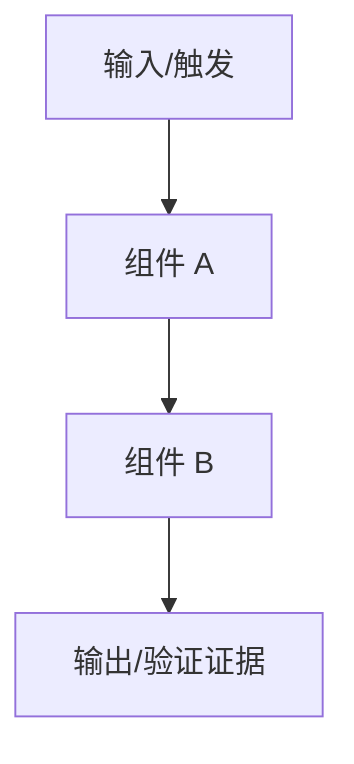
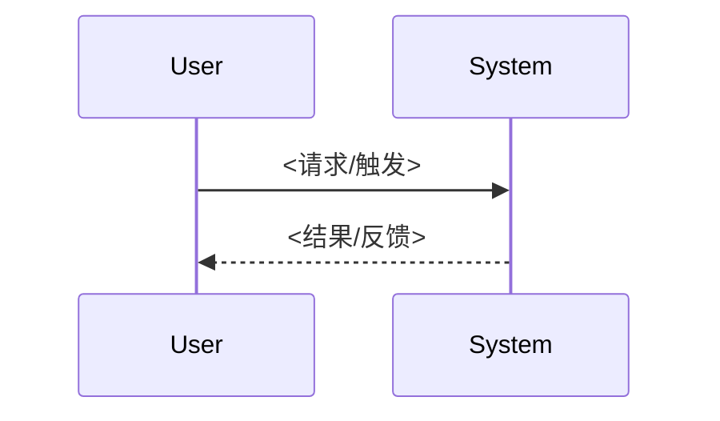

# 设计文档：<功能名称>

## 概述

<说明技术目标、当前系统状态、关键约束，以及设计如何满足 R1/R2。>

## 当前实现分析

| 路径/模块 | 当前行为 | 目标行为 | 差异/风险 | 关联需求 |
| --- | --- | --- | --- | --- |
| <file:function> | <现在怎么做> | <改完怎么做> | <潜在回归> | R1 |
| <file:function> | <现在怎么做> | <改完怎么做> | <潜在回归> | R2 |

## 架构



## 组件与接口

### <组件/模块名>

**职责：** <该组件负责什么，不负责什么。>

**输入契约：** <调用者必须提供哪些参数/状态。>

**输出契约：** <成功返回什么，副作用是什么。>

**失败契约：** <失败条件、错误码/message、是否阻止下游调用。>

**接口：**

```text
<function/api/event/config contract>
```

**关联需求：** R1

## 数据模型

- **<模型/状态/配置>**: 字段、来源、生命周期、读写方、兼容影响。
- **<模型/状态/配置>**: 字段、来源、生命周期、读写方、兼容影响。

## 数据流



## 错误与边界矩阵

| 场景 | 触发条件 | 期望结果 | 处理位置 | 验证方式 | 关联需求 |
| --- | --- | --- | --- | --- | --- |
| <主路径> | <输入/状态> | <输出/状态> | <file:function> | <test/command> | R1 |
| <失败/边界> | <输入/状态> | <错误/回退> | <file:function> | <test/command> | R2 |

## 关键决策

| 编号 | 决策 | 选择 | 理由 | 替代方案 |
| --- | --- | --- | --- | --- |
| D1 | <决策主题> | <选择> | <为什么满足 R1/R2> | <未采用方案及原因> |
| D2 | <决策主题> | <选择> | <为什么满足 R1/R2> | <未采用方案及原因> |

## 测试方案

- 单元测试：<核心转换、状态、解析或边界逻辑>
- 集成测试：<跨组件/接口/外部依赖主路径>
- 异常/兼容测试：<失败路径、旧数据、回退、权限或迁移>
- 人工验收：<需要人工确认的结果和证据>

## 兼容性与迁移

<说明旧数据、旧配置、旧接口、权限、安全、性能或可靠性影响；如果没有，说明为什么无需迁移。>

## 风险与缓解

- <风险> -> <缓解/回退/监控方式>
- <风险> -> <缓解/回退/监控方式>
