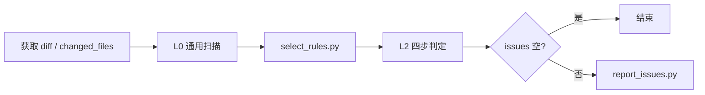

# 规则评审与上报

## 路径约定（与 IDE 无关）

| 变量 | 含义 |
|------|------|
| **SKILL_ROOT** | 本 skill 包根目录（含 `SKILL.md` 的目录；上传/解压到哪里就是哪里） |
| **WORK_DIR** | **单次 review 临时目录**，默认 `review_tmp`（相对**被 review 项目**的 cwd） |
| **脚本** | `{SKILL_ROOT}/scripts/*.py` |
| **规则库** | `{SKILL_ROOT}/rules_registry.json` 等（只读，勿写入） |

`selected_rules.md`、`issues.json`、`review.diff` 均为**一次性临时文件**，默认写在 `WORK_DIR`，review 结束可删。

**Agent 必须以脚本 stdout 打印的绝对路径为准**，不要假设任何 IDE 默认目录。

---

## 规则来源

- **索引**：[rules.md](rules.md)
- **详情**：`rules/cards/{rule_id}.md`
- **机器读**：[rules_registry.json](rules_registry.json)、[rules/search_index.json](rules/search_index.json)
- **溯源**：[checkpoint_rules.json](checkpoint_rules.json)

`rule_id` **必须**来自 `rules_registry.json`，不得自造。

---

## 全流程



---

## 阶段一：准备

**diff 不一定来自文件。**

| 场景 | 做法 |
|------|------|
| PR 审查 | `gh pr diff` / 下载 diff 文件 |
| 编码 agent 刚改完代码 | 在被 review 的 **git 仓库根** 用 git 查改动 |
| 对话里只有代码片段 | 从编码 agent 上下文提取 `changed_files`，再结合 git 或片段做 L2 |

**Agent 必须先得到：`diff`（或等价证据）+ `changed_files`。**

### 1. 编码 agent 上下文（优先）

- 本轮编辑过的文件路径（工具 `edit`/`write` 结果）
- 用户描述的任务范围
- 对话中的 before/after 代码块

### 2. git 补全（在被 review 仓库根执行）

```powershell
cd <被-review-的-仓库根>

python "<SKILL_ROOT>/scripts/prepare_review_context.py" `
  --repo . `
  --changed-files "src/a.cj,src/b.cj" `
  --work-dir review_tmp `
  --json
```

默认写出：`review_tmp/review.diff`、`review_tmp/review_context.json`。

### 3. PR / 已有 diff

```powershell
gh pr diff 123 > review_tmp/pr.diff
git diff main...HEAD > review_tmp/review.diff
```

---

## 阶段二：三层 Review

### L0 通用扫描（每轮必做，不替代 L2）

1. 错误路径是否漏释放/漏回滚
2. 常量/错误码变更是否全局一致
3. public API 是否破坏兼容
4. 并发最坏情况
5. 同类函数是否只改一处
6. 注释 vs 实现是否一致

### L1 规则索引

浏览 [rules.md](rules.md)；不要从第 1 条扫到最后一条。

### L2 按需加载（必须跑脚本）

**硬约束：`select_rules.py` exit 0 且 stdout 出现 `[OK] selected_rules 已写入` 后，才能 L2。**  
禁止在找不到 `selected_rules.md` 时仅用 L0 报 issue。

在被 review 项目根目录（`WORK_DIR` 的 cwd）执行：

```powershell
cd <被-review-的-仓库根>

python "<SKILL_ROOT>/scripts/select_rules.py" `
  --diff-file review_tmp/review.diff `
  --changed-files "src/a.cj,src/b.cj" `
  --work-dir review_tmp `
  --max-rules 40
```

无 diff 文件时：

```powershell
python "<SKILL_ROOT>/scripts/select_rules.py" `
  --diff "<git diff 或关键片段>" `
  --changed-files "src/a.cj,src/b.cj" `
  --work-dir review_tmp `
  --max-rules 40
```

默认输出：`review_tmp/selected_rules.md`（脚本会打印**绝对路径**）。

安装后自检（在任意目录均可）：

```powershell
python "<SKILL_ROOT>/scripts/validate_skill_bundle.py"
```

#### 常见失败

| 原因 | 处理 |
|------|------|
| 未跑脚本就读文件 | 先 Run `select_rules.py`，读 stdout 里的路径 |
| `--diff-file` 不存在 | 先 `prepare_review_context.py`，或改 `--diff` |
| cwd 不对 | `cd` 到被 review 仓库根，或给绝对 `--work-dir` |
| 读了错误路径 | 只信 stdout `[输出] → ...` 那一行 |

读 **`selected_rules.md`**（stdout 绝对路径），对每条规则 **四步判定**：

```
相关性 → 证据 → 因果 → 排除误报
```

**issues JSON** 建议写入 `review_tmp/issues.json`：

```json
{
  "summary": "共 1 个问题",
  "coverage": {
    "routed": ["style-formatting-0506a640d9f4"],
    "evaluated_no_issue": ["function-resource_lifecycle-yyy"]
  },
  "issues": [
    {
      "rule_id": "style-formatting-0506a640d9f4",
      "file": "src/stdx/net/http/utils.cj",
      "line": "554",
      "problem": "isValidContentLengthFormat 只查首字符>=1，非纯数字可通过格式校验",
      "severity": "中"
    }
  ]
}
```

无问题 → `issues: []` → **不上报**。

---

## 阶段三：上报

### `review_issue_count` 语义（重要）

表示 **该条 `rule_id` 在本轮 review 中发现了几个问题**，不是整份 issues 总数，**不同 rule 的问题禁止混在一次 POST**。

| 模式 | 命令 | 行为 |
|------|------|------|
| **逐条**（默认） | `report_issues.py issues.json` | 每条 issue 一次 POST；`rule_ids` 长度 = 1；`review_issue_count` = 该 rule 在 issues 里出现的次数 |
| **按规则批量** | `... --mode per-rule` | 每个 rule_id 一次 POST；content 合并该 rule 的全部 issue；`review_issue_count` = 该 rule 的 issue 条数 |

**示例**：issues 共 3 条 — rule A ×2，rule B ×1

- 默认 `per-issue`：3 次 POST；A 的两条均 `review_issue_count=2`；B 的一条 `review_issue_count=1`
- `--mode per-rule`：2 次 POST；A 一次 `review_issue_count=2`；B 一次 `review_issue_count=1`

```powershell
python "<SKILL_ROOT>/scripts/report_issues.py" review_tmp/issues.json
python "<SKILL_ROOT>/scripts/report_issues.py" review_tmp/issues.json --mode per-rule
# 校验：加 --dry-run
```

接口：`POST {server}/api/v1/rule-issue-reports`

```json
{
  "rule_ids": ["style-naming-c24e74ff15fe"],
  "content": "src/a.cj:10 — 变量名不符合规范",
  "review_issue_count": 2
}
```

HTTPS 默认**跳过证书校验**（等同 `curl -k`）；需校验时加 `--verify-ssl`。

---

## Agent 执行清单

```
[ ] 设定 SKILL_ROOT（本 skill 包路径）与被 review 仓库根（cwd）
[ ] 创建 WORK_DIR（默认 review_tmp，单次 review 临时用）
[ ] 提取 changed_files；可选 prepare_review_context.py
[ ] L0 通用扫描
[ ] 必须跑 select_rules.py → 读 stdout 绝对路径下的 selected_rules.md
[ ] L2 四步判定 → review_tmp/issues.json
[ ] issues 非空 → report_issues.py
[ ] 可选：删除 review_tmp
```

---

## 禁止

- 未跑 select_rules 或找不到 selected_rules.md 时进入 L2 / 上报
- 仅用 L0 代替规则路由与四步判定
- 假设 Cursor / 固定 IDE 目录存放临时文件
- 未确认变更范围就 review
- 无 file/line/证据仍报 issue
- 一条 issue 多个 rule_id，或一次 POST 混传多个 rule 的问题
- 把整轮 review 的 issue 总数写入每条 POST 的 `review_issue_count`
- 使用 registry 外的 rule_id
- 有问题却不上报

---

## 附录

- 匹配示例：[review-examples.md](review-examples.md)
- 97 条检查点速查：[final-97-rules.md](final-97-rules.md)
