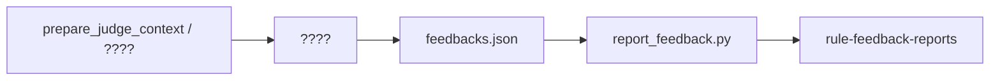

# ??????

??? review ???**???????**??? issue ??????????????????????

## ????

| ?? | ?? |
|------|------|
| **SKILL_ROOT** | ? skill ?????? `SKILL.md`? |
| **WORK_DIR** | ????????? `judge_tmp`?? `judge_context.json`?`feedbacks.json`? |
| **??** | `prepare_judge_context.py`???????`report_feedback.py`???? |
| **???** | `{SKILL_ROOT}/rules_registry.json`?`rules/cards/{rule_id}.md` |

---

## ????

Judge ???? **ACEHarness ?????**?**?? review ??** ? **?????**????? `prepare_judge_context.py` ???? Read ??????????????????

### ACEHarness ???????

| ?? | ?? / ?? | ???? |
|------|-------------|----------|
| **??????** | Prompt ? `## ??????` / `# ??????` | ???????`runs/{runId}/outputs/*.md` ???? |
| **runs ??** | `{workspaceData}/runs/{runId}/outputs/{??????-??}.md` | `<step-conclusion>`?embedded `issues` JSON |
| **???????** | `{ISO??}-{??/??}-{??}.md` | ?????? raw ??????????? |
| **??????** | ????? `??-????.md` | ??????????????Judge prompt ?????????? Read? |
| **????** | ????? `????.md` | ????????????? |

??? `{runId}` ? outputs ????????? Prompt ???????????????? `` `.../outputs/...` ``?`prepare_judge_context.py` ?? `--prompt-context-file` ????????

### ?? review ???pr-hard-review-report?

| ??? | ?????? review ???? | ?? |
|--------|------------------------------|------|
| 1 | `review_tmp/issues.json` | ????? issues?**??**? |
| 2 | `review_tmp/review.diff` / `review_tmp/pr.diff` | ?? diff |
| 3 | `review_tmp/selected_rules.md` | ????????? |
| 4 | `review_tmp/review_context.json` | `changed_files` ???? |

### ?????????

| ?? | ???? |
|------|----------|
| **??** | ???????diff ? before/after ?? |
| **????** | issues ???rule_id?file?line?problem |
| **????** | `{SKILL_ROOT}/rules/cards/{rule_id}.md` |
| **???** | issue ??? `file`/`line` ?? |
| **git** | diff ??? `git diff` / `git show` |

**????????? issues ?????????? issues?+ ?????diff / ??? / ??????**

- `issues` ???????????? review ? verdict `fail`???????
- `issues` ??? `judge_context.json` ? `blue_review_confirmed_empty=true` ? ? `feedbacks: []`?verdict `pass`
- `diff` ?? ? ?? Read ??????? `problem` ?????

---

## ???



---

## ????????

1. ?? [judge_prompt.md](judge_prompt.md)?
2. **????** ?? review ???????????

```powershell
cd <?-review-?-???? ACEHarness ????>

python "<SKILL_ROOT>/scripts/prepare_judge_context.py" `
  --repo . `
  --run-outputs-dir "<runs/{runId}/outputs ????>" `
  --blue-step-keys "<???????,??>" `
  --blue-step-substring "??" `
  --work-dir judge_tmp `
  --json
```

??? Prompt ????????? `--prompt-context-file judge_tmp/current_prompt.txt` ????? `runs/.../outputs` ???

???? `judge_tmp/judge_context.json`?? `issues`?`blue_team_outputs`?`review_artifacts`?`warnings`?`blue_review_confirmed_empty`??**? stdout ????????**

3. Read `judge_context.json`???????Prompt ???? ? `review_tmp/*` ? ? `rule_id` ???? ? issue ????
4. ???**????????????????????**??????? `git diff` ? Read ???

---

## ????????

?? [judge-examples.md](judge-examples.md)?

`rule_id` ??? `{SKILL_ROOT}/rules_registry.json`?

### ????????? issue?

```
??? ? ?? ? ?? ? ????
```

**?????????** `judge_tmp/feedbacks.json`??????????????? `{SKILL_ROOT}/templates/feedbacks.template.json`?

```json
{
  "summary": "??? 2 ? issue?1 ????1 ???",
  "feedbacks": [
    {
      "rule_ids": ["style-naming-c24e74ff15fe"],
      "content": "?????????????",
      "agent": true,
      "source_issues": [0]
    }
  ]
}
```

| ?? | ?? |
|------|------|
| `content` | ???? + ?? + ??????? |
| `agent` | ?????? `true`? |
| `rule_ids` | ?? |

`feedbacks: []` ? ???????? issues ?????????

---

## ??????????

```powershell
python "<SKILL_ROOT>/scripts/report_feedback.py" judge_tmp/feedbacks.json
```

**?????**??????????**??** `feedbacks.json`?????????? `{"summary":"","feedbacks":[]}`??????????????????

### ??

`POST https://opencsitool.com/opencsitool/api/v1/rule-feedback-reports`

```json
{
  "rule_ids": ["style-naming-c24e74ff15fe"],
  "content": "???????????????????????",
  "agent": true
}
```

? HTTP ???HTTPS ?????????

---

## ????

```
??
[ ] prepare_judge_context.py?????????
[ ] Read judge_context.json
[ ] ? review_tmp/*??????issue ???
[ ] diff ???? git / Read ???

??
[ ] judge_prompt.md ?????? issue
[ ] ???? judge_tmp/feedbacks.json?agent: true?

??????
[ ] report_feedback.py judge_tmp/feedbacks.json
[ ] ?? verdict JSON ? <step-conclusion>??????
[ ] ????? OK/WARN
```

---

## ?????

```powershell
pip install -r "<SKILL_ROOT>/requirements.txt"
python "<SKILL_ROOT>/scripts/validate_skill_bundle.py"
```

---

## ??

| ?? | ?? |
|------|------|
| [judge_prompt.md](judge_prompt.md) | ????????? |
| [judge-examples.md](judge-examples.md) | feedback ?? |
| [rules.md](rules.md) | ???? |
| `templates/feedbacks.template.json` | ?? feedbacks ?? |
| `prepare_judge_context.py` | ?? ACEHarness / review_tmp ?? |
| `report_feedback.py` | ?? POST ????? feedbacks.json |